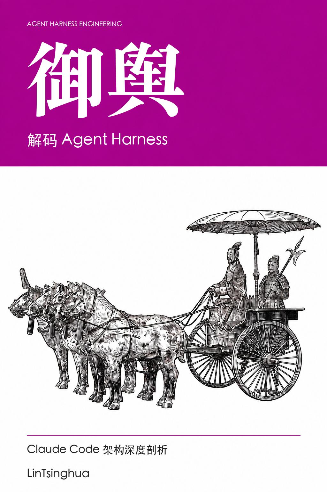
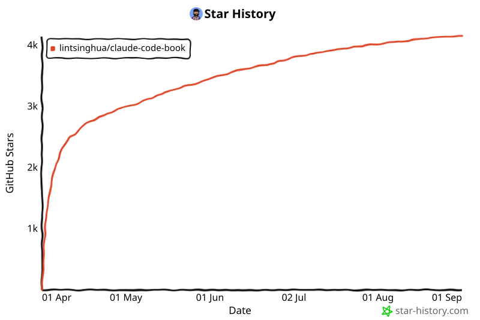

# 御舆：解码 Agent Harness

Claude Code 架构深度剖析

**中文** · [English](en/README.md)

从对话循环、工具调用和权限检查，到记忆、上下文管理与多智能体编排，理解一个 Agent 运行时如何协同工作。全书 15 章、4 篇附录，结合架构图、设计权衡与动手练习，逐步构建自己的 Agent Harness。

> *“一器而工聚焉者，车为多。”* ——《考工记》
>
> 两千年前，造车已是一项汇聚众工的系统工程：**舆**承载乘者，辕、辐、軎辖各司其职。部件相合，车方能行。
>
> 今天，构建一个 AI Agent 亦是如此：对话循环推进任务，工具系统执行动作，权限管线约束边界。而将这些能力承载、组织起来，使智能体持续运转的运行时框架——**Agent Harness**——恰如车之有**舆**。
>
> 古人造车，合众工之巧；今人构建智能体，亦需理解各部分如何协作。所谓“御舆”，既是驾驭，也是知其构造、明其机理。
>
> 本书因此以 **“御舆”** 为名，亦称 **舆书**。

## 开始阅读

- **初次阅读：** 从[前言](00-前言.md)开始，再读 01 → 02 → 04 → 15。
- **动手构建：** 先读基础篇与工程实践篇，增加记忆和扩展能力时查阅第二、三部分。
- **按需查阅：** 使用下方四篇附录定位模块、工具、功能标志和术语。
- **网站阅读：** [在线阅读入口](https://lintsinghua.github.io/)；也可直接点击本仓库的章节链接。

## 阅读说明

阅读时需区分源码可确认的行为、架构推演和教学示例。功能标志与工具可用性取决于构建和运行时配置；数量和耗时示例不代表当前发行版承诺。

Claude Code 为 Anthropic 产品，本书是独立的技术分析作品，并非官方出版物。本书的许可不覆盖第三方源码。

## 目录

### Part 1. 基础篇 — 建立心智模型

> 理解 Agent 编程的范式转移，建立对 Agent Harness 的整体认知框架。

| # | 章节 | 核心内容 |
|:-:|------|---------|
| 01 | [智能体编程的新范式](第一部分-基础篇/01-智能体编程的新范式.md) | Copilot → Claude Code 演进；Agent Harness 五大设计原则；Bun + React/Ink + Zod v4 技术栈 |
| 02 | [对话循环 — Agent 的心跳](第一部分-基础篇/02-对话循环-Agent的心跳.md) | `while(true)` 异步生成器主循环；五种 yield 事件；十种终止原因；`QueryDeps` 依赖注入 |
| 03 | [工具系统 — Agent 的双手](第一部分-基础篇/03-工具系统-Agent的双手.md) | `Tool<I,O,P>` 五要素协议；`buildTool` 故障安全工厂；45+ 工具 × 12 类；并发分区贪心算法 |
| 04 | [权限管线 — Agent 的护栏](第一部分-基础篇/04-权限管线-Agent的护栏.md) | 四阶段管线；五种权限模式谱系；Bash 规则匹配；推测性分类器 2 秒 Promise.race |

### Part 2. 核心系统篇 — 深入子系统

> 拆解 Agent Harness 的四大核心子系统——配置、记忆、上下文、钩子。

| # | 章节 | 核心内容 |
|:-:|------|---------|
| 05 | [设置与配置 — Agent 的基因](第二部分-核心系统篇/05-设置与配置-Agent的基因.md) | 六层配置优先级链；合并规则；安全边界与供应链攻击防御；双层功能门控 |
| 06 | [记忆系统 — Agent 的长期记忆](第二部分-核心系统篇/06-记忆系统-Agent的长期记忆.md) | 四种封闭式记忆类型；"只保存无法推导的信息"；MEMORY.md 索引；Fork 记忆机制 |
| 07 | [上下文管理 — Agent 的工作记忆](第二部分-核心系统篇/07-上下文管理-Agent的工作记忆.md) | 有效窗口公式；四级渐进压缩（Snip→MicroCompact→Collapse→AutoCompact）；断路器模式 |
| 08 | [钩子系统 — Agent 的生命周期扩展点](第二部分-核心系统篇/08-钩子系统-Agent的生命周期扩展点.md) | 五种 Hook 类型；26 个生命周期事件；JSON 响应协议；六层优先级；三层安全机制 |

### Part 3. 高级模式篇 — Agent 的组合与扩展

> 探索 Agent 如何组合、编排和扩展——从子智能体到 MCP 协议桥接。

| # | 章节 | 核心内容 |
|:-:|------|---------|
| 09 | [子智能体与 Fork 模式](第三部分-高级模式篇/09-子智能体与Fork模式.md) | 三种 Agent 来源；智能体职责与可用性门控；Fork 字节级上下文继承；递归 Fork 防护 |
| 10 | [协调器模式 — 多智能体编排](第三部分-高级模式篇/10-协调器模式-多智能体编排.md) | Coordinator-Worker 双重门控；"只编排不执行"约束；四种寻址模式；四阶段工作流 |
| 11 | [技能系统与插件架构](第三部分-高级模式篇/11-技能系统与插件架构.md) | 11 个核心技能；SKILL.md frontmatter；三级参数替换；分层加载；插件缓存 |
| 12 | [MCP 集成与外部协议](第三部分-高级模式篇/12-MCP集成与外部协议.md) | 8 类连接配置；五态连接管理；三段式工具命名；Bridge 双向通信系统 |

### Part 4. 工程实践篇 — 从原理到构建

> 性能优化的工程细节，以及从零构建一个完整 Harness 的实战路线图。

| # | 章节 | 核心内容 |
|:-:|------|---------|
| 13 | [流式架构与性能优化](第四部分-工程实践篇/13-流式架构与性能优化.md) | QueryEngine 生命周期管理；并发控制；并行预取与启动耗时估算；惰性加载策略 |
| 14 | [Plan 模式与结构化工作流](第四部分-工程实践篇/14-Plan模式与结构化工作流.md) | "先想后做"哲学；计划文件三层恢复策略；本地调度与远程触发 |
| 15 | [构建你自己的 Agent Harness](第四部分-工程实践篇/15-构建你自己的Agent-Harness.md) | 六步实现路线图；循环依赖解决方案；四层可观测性体系；安全威胁模型 |

### Appendix — 参考资料速查

| | 内容 |
|:-:|------|
| [A](附录/A-源码导航地图.md) | **架构导航地图** — 16 个核心模块、依赖树、6 条数据流路径、四层架构、10 种设计模式 |
| [B](附录/B-工具完整清单.md) | **工具完整清单** — 50+ 工具 × 12 类，readOnly/destructive/concurrencySafe 属性 |
| [C](附录/C-功能标志速查表.md) | **功能标志速查表** — 89 个 Flag × 13 类，编译时/运行时类型，依赖关系图 |
| [D](附录/D-术语表.md) | **术语表** — 100 条中英对照术语，含交叉引用和章节定位 |

## 参与修订

欢迎通过 Issue 或 PR 修正技术错误、补充案例和改进表达。请提供章节、小节、建议修改和参考来源；显示问题请注明阅读平台和复现步骤。涉及双语内容时，请同步检查英文版。

提交前运行 `python3 scripts/check_book.py` 和 `python3 -m unittest discover -s tests`。Mermaid 语法检查需要 Node.js 22 或更高版本：先运行 `npm ci`，再运行 `npm run check:diagrams`。

## 许可与致谢

本书文字采用 [CC BY-NC-SA 4.0](https://creativecommons.org/licenses/by-nc-sa/4.0/)：须署名、非商业使用，并以相同协议共享改编内容。第三方资料保留其原有权利与许可条件。感谢 [Linux.Do](https://linux.do/) 社区。

## Star History

<a href="https://star-history.com/#lintsinghua/claude-code-book&Date">
 <picture>
   <source media="(prefers-color-scheme: dark)" srcset="docs/images/star-history-dark.svg" />
   <source media="(prefers-color-scheme: light)" srcset="docs/images/star-history-light.svg" />
   
 </picture>
</a>
