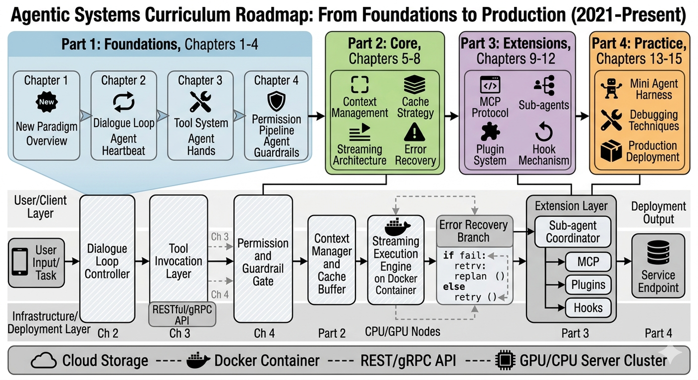

# Foreword

## Why This Book

### The Three Waves of AI-Assisted Programming

Looking back over the past few years, AI-assisted programming has gone through three distinct waves, each profoundly changing the relationship between developers and code:

**The First Wave (2021-2022): The Code Completion Era.** The launch of GitHub Copilot marked the formal entry of AI into developers' daily workflows. The core paradigm of this stage was "inline completion" -- AI predicted the next line or code block based on the current file context, and developers accepted suggestions with the Tab key. This was a highly passive, highly localized mode of assistance: AI saw dozens of lines of code around the cursor and output fragment-level suggestions. It could not reason across files, understand project structure, or proactively execute operations.

**The Second Wave (2023-2024): The Conversational Assistant Era.** With the expansion of context windows and the emergence of multi-file awareness, AI tools evolved from "completion boxes" to "dialog boxes." Editor-embedded tools like Cursor, Windsurf, and Continue flourished. Developers could describe requirements in natural language, and AI would generate code across multiple files. But AI at this stage was still constrained by the editor boundary -- it could write code but not run it; it could suggest tests but not execute them; it could identify problems but not verify fixes. Developers constantly switched between AI and the terminal, acting as human "glue."

**The Third Wave (2025 to present): The Autonomous Agent Era.** The paradigm shift we are experiencing is far more profound than the previous two. AI is no longer "an assistant sitting in the editor waiting for your questions," but "an agent that autonomously executes tasks in the terminal." It can directly run Shell commands, read and write the file system, execute test suites, and operate Git version control -- and when encountering errors, it autonomously adjusts its strategy and iteratively fixes them. From simple code completion to multi-file refactoring, from single-turn Q&A to cross-tool orchestration, AI programming assistants are undergoing a fundamental paradigm shift from Chatbot to Agent.

These three waves can be summarized in a concise evolution diagram:

### Agent Harness: The Birth of a New Architectural Concept

During this transition, a key architectural pattern has surfaced: **Agent Harness** -- a runtime framework built around an LLM, responsible for managing tool registration and dispatch, permission control, state persistence, streaming output, error recovery, and other cross-cutting concerns.

The best way to understand Agent Harness is through an analogy. Imagine the LLM as a brilliant scholar who has never left their study. They are immensely knowledgeable and possess extraordinary reasoning abilities, but know nothing of the outside world -- they cannot use tools, operate machines, or even make a phone call. Agent Harness is this scholar's "exoskeletal armor system": it equips the scholar with hands (the tool system), installs safety locks (the permission pipeline), provides a memory manager (context compression), and connects a nervous system (streaming communication). The scholar wearing this armor is no longer just a thinking brain, but an agent capable of executing tasks safely and efficiently in the real world.

This analogy reveals the essence of Agent Harness: **it is not an SDK, not an API wrapper, and certainly not simple prompt engineering -- it is the engineering infrastructure that enables an LLM to truly "do things."** If the LLM is the Agent's brain, then the Agent Harness is the Agent's skeleton, muscles, nerves, and immune system.

### The Birth of Claude Code and Its Accidental Public Disclosure

In early 2025, Anthropic released Claude Code -- an AI programming agent that runs in the terminal. It does not depend on a specific editor or a graphical interface; instead, it runs directly in the command line in a decidedly hacker-like fashion. This choice is itself a statement: an Agent does not need the constraints of a GUI; it needs a fully-featured runtime environment.

On March 31, 2026, an unexpected event propelled Claude Code into the spotlight of the tech community: security researcher [Chaofan Shou (@Fried_rice)](https://x.com/Fried_rice) discovered that the `@anthropic-ai/claude-code` package published in the npm registry contained a source map file referencing a complete source code archive in an Anthropic R2 storage bucket, and the bucket had no access controls. The disclosure tweet received over 17 million views, and the tech community engaged in an unprecedented in-depth discussion about Agent architecture. Anthropic subsequently patched the configuration issue.

It was this discussion that made us realize: Agent Harness had evolved from an obscure engineering concept into a topic the entire developer community cares about. But most of the discussions on the market were scattered and fragmented -- some focused on tool call design, others discussed permission models, and still others analyzed streaming architecture, yet no one had assembled these pieces into a complete picture.

This book attempts to fill that gap. We do not rely on any unauthorized materials; instead, based on Claude Code's public documentation, product behavior, and community discussions, we systematically deduce and explain the design principles of Agent Harness.

### Why Now

You might ask: is the timing right for such a book? The answer is yes, for three reasons:

1. **Architectural patterns are converging.** Although different Agent frameworks vary in implementation details, the core architectural patterns -- dialog-loop-driven execution, tool type systems, layered permission pipelines, and streaming state management -- have converged across multiple mainstream projects. This means the design patterns summarized here have broad applicability and will not become outdated by any single framework's version update.

2. **Engineering challenges have been fully exposed.** After two years of practice, the core engineering challenges facing Agent systems are clearly visible: context window management, security and concurrency of tool calls, state consistency during long-running operations, error recovery and retry strategies, and so on. These problems will not disappear as model capabilities improve -- on the contrary, as Agents execute more complex tasks, these engineering issues will become even more acute.

3. **The developer community is ready.** More and more developers are no longer satisfied with the superficial usage of "calling an API to build a chatbot." They want to understand the internal mechanisms of Agent systems so they can build their own Agent applications. This book is written for those developers.

## Why Claude Code Is Worth Studying in Depth

Choosing Claude Code as the subject of analysis for this book is not based on a preference for any particular company, but on several objective judgments:

**First, architectural representativeness.** Claude Code covers all core subsystems of an Agent Harness: tool type system, permission pipeline, state management, context compression, MCP protocol integration, and sub-agent dispatch. Understanding Claude Code's architecture establishes a mental model that can be transferred to any Agent framework.

To use an analogy: studying Claude Code's architecture is like a medical student studying human anatomy -- although every patient is a different individual, the basic structure of bones, muscles, nerves, and blood vessels is the same. Once you master this "standard anatomy chart," you can understand the "body structure" of any Agent system.

**Second, traceability of engineering decisions.** Claude Code's design is full of meaningful traces of engineering decisions. For example:

- Why does the main dialog loop use streaming async generators instead of callbacks or Promise chains? (The answer involves backpressure control, cancellation propagation, and composability -- see Chapter 2 for details)
- Why does the permission system use a four-stage pipeline instead of a simple allowlist/blocklist? (The answer involves defense in depth and separation of concerns -- see Chapter 4 for details)
- Why does the tool type design include fine-grained control interfaces for concurrency safety and interrupt behavior? (The answer involves parallel scheduling strategies and user experience -- see Chapter 3 for details)

The insights behind these decisions come from deep understanding of real production scenarios and are far more valuable than abstract architectural discussions. The answer to every "why" is a design lesson.

**Third, modernity of the technology stack.** Claude Code chose Bun as its runtime, React + Ink for terminal UI rendering, Zod v4 for runtime validation, and Commander.js for CLI handling -- these technology choices are themselves a reference blueprint for modern TypeScript engineering. Even if you are not interested in Agent architecture, Claude Code is worth studying purely from an engineering practices perspective.

**Fourth, reference value at scale.** As a project with over 500,000 lines of TypeScript code, Claude Code demonstrates how to maintain modularity, testability, and extensibility in a large codebase. Its tool type system, permission pipeline, and state management solutions can be directly applied to your own projects.

## Features of This Book

This book has three core features that distinguish it from other AI-related books on the market:

**Based on architectural analysis, not API documentation.** We will not teach you "how to call the Claude API to build a chatbot." Instead, starting from Claude Code's product behavior and public information, we progressively reconstruct its core architecture -- how the dialog loop drives execution, how permissions are checked in layers, and how context is compressed. Through systematic architectural deduction, we present the complete design picture of Agent Harness.

**Starting from design philosophy, not usage tutorials.** We will not list "10 tips to make Claude Code work better for you." Instead, we discuss the five major design principles of Agent Harness -- async-streaming-first, embedded security boundaries, cache-aware design, progressive capability extension, and immutable state flow -- and how these principles map to concrete code structures.

**Emphasizing transferable architectural knowledge.** Each chapter distills universal design patterns that go beyond Claude Code itself. After reading this book, you will not only understand Claude Code's internal mechanisms, but also be able to apply this knowledge to your own Agent projects, whether you use LangChain, AutoGen, or build from scratch.

## Reader Profiles and Reading Paths

### Four Core Reader Types

This book is suitable for the following readers, each of whom can gain unique value:

**Architects and technical leaders** who are evaluating or building AI Agent systems and need to understand the design space and engineering trade-offs of Agent Harness. For these readers, this book provides a complete architectural decision map to help you make informed judgments on key issues such as "build vs. adopt a framework" and "which subsystems to prioritize investment in."

**Senior engineers** who already have TypeScript/Node.js experience and want to deeply understand how to build reliable engineering systems on top of LLMs. For these readers, the design patterns in this book (async generator loops, layered permission pipelines, immutable state management) can be directly applied to daily engineering practice, even if you are not currently building an Agent system.

**AI application developers** who are not satisfied with the superficial usage of calling APIs and want to master core technologies such as tool calling, streaming processing, and permission control. For these readers, the systematic explanation from "why" to "how" will help you grow from an API caller to a system builder.

**Researchers curious about Agent technology** who want to understand how Agent systems work from an engineering implementation perspective. For these readers, this book provides a complete view from macro architecture to micro implementation, filling the cognitive gap between academic papers and engineering practice.

### Reading Path Recommendations

This book is divided into four parts, organized from macro to micro, from concept to implementation:

**If you are short on time (Fast Path):** Read at least Chapter 1 (to establish a mental model) and Chapter 2 (to understand the core loop), then spend 15 minutes browsing the key takeaways sections of Chapters 3-4. These two chapters are the foundation for understanding everything that follows.

**If you are an experienced engineer (Deep Path):** You can start directly from Part 2, referring back to the corresponding chapters in Part 1 when you encounter conceptual gaps. Focus on the "Design Decision Analysis" subsections in each chapter -- these are the most inspiring parts for your daily engineering practice.

**If you are a beginner (Complete Path):** We recommend reading in order, and completing every hands-on exercise in each chapter. These exercises are designed to build progressively -- the installation diagnostic in Chapter 1 is a prerequisite for tracing tool call flows in Chapter 2, and the custom tool exercise in Chapter 3 lays the foundation for permission configuration in Chapter 4.

**If you are an architect (Evaluation Path):** Focus on Chapter 1 (architectural overview), Chapter 2 (core loop design), and Chapter 4 (permission pipeline), then jump directly to Part 4. This path helps you evaluate the design space and engineering complexity of Agent Harness in the shortest possible time.

### Knowledge Map and Chapter Connections

The chapters in this book have tight cross-reference relationships. Understanding these connections helps you build a systematic cognitive framework:

- **Chapter 1**'s five design principles (async-streaming-first, embedded security boundaries, cache-aware design, progressive capability extension, and immutable state flow) are the thread running through the entire book. Each subsequent chapter is an unfolding of these principles in specific subsystems.
- **Chapter 2**'s dialog main loop is the "hub" of the book -- it connects the tool system (Chapter 3), the permission pipeline (Chapter 4), context management (Part 2), and sub-agent dispatch (Part 3).
- **Chapter 3**'s tool type system defines the interface contract checked by Chapter 4's permission pipeline, while Chapter 3's orchestration engine depends on Chapter 2's async generator pattern.
- **Chapter 4**'s permission pipeline is embedded into Chapter 2's dialog main loop and Chapter 3's tool execution flow, embodying the "embedded security boundaries" design principle.

## About This Book

This book is based on an in-depth analysis of Claude Code's product architecture, combining public documentation, community discussions, and product behavior to systematically explain its design philosophy and Agent Harness best practices. The analytical method of this book is: starting from Claude Code's observable behavior, combined with Anthropic's official documentation and public community discussions, to deduce and reconstruct its architectural design principles.

---

## Acknowledgments

This book could not have been written without the excellent engineering practices of the Claude Code development team. It is their carefully designed product architecture that makes in-depth technical analysis possible. The analysis in this book is based on Claude Code's public documentation and product behavior, and is intended solely for educational and academic purposes.

---

*In 2026, as AI Agents are reshaping the way software engineering works, we hope this book helps you become not only a better Agent user, but a discerning Agent builder.*
