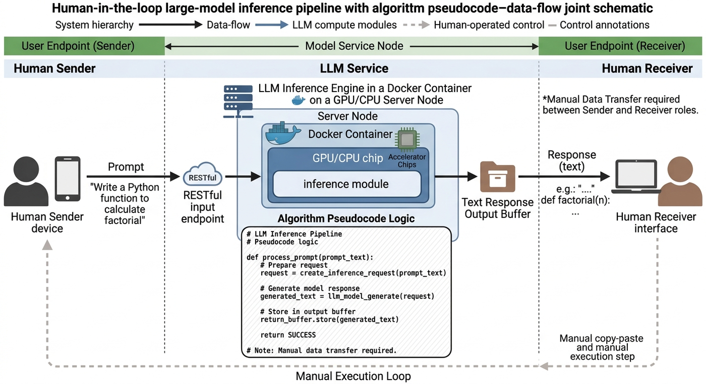
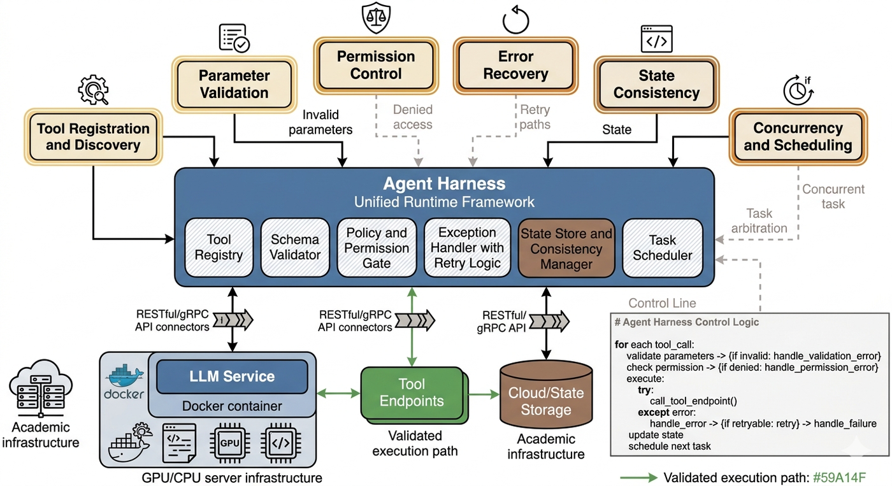
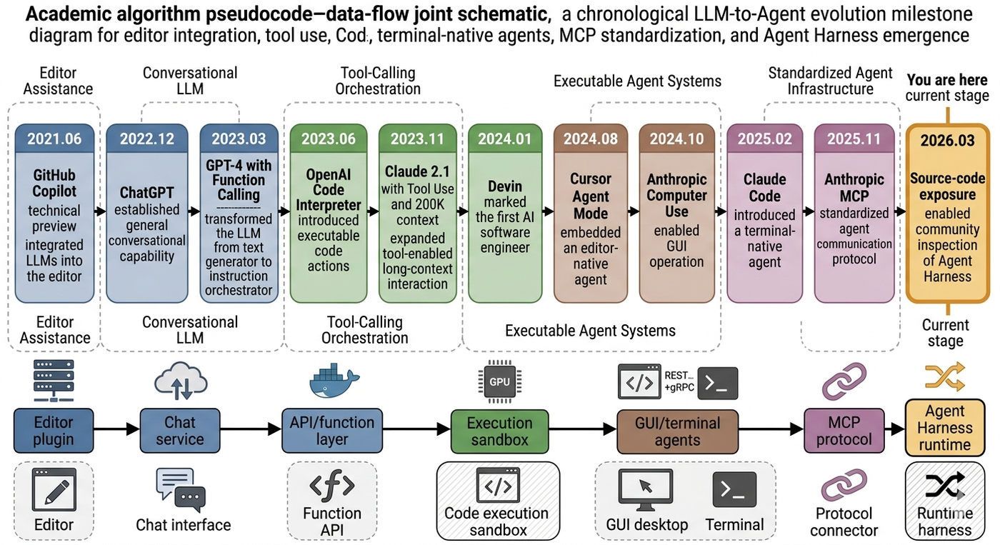
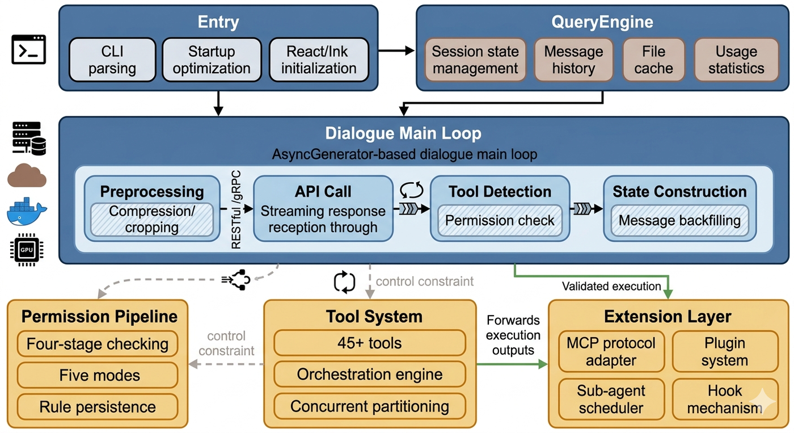
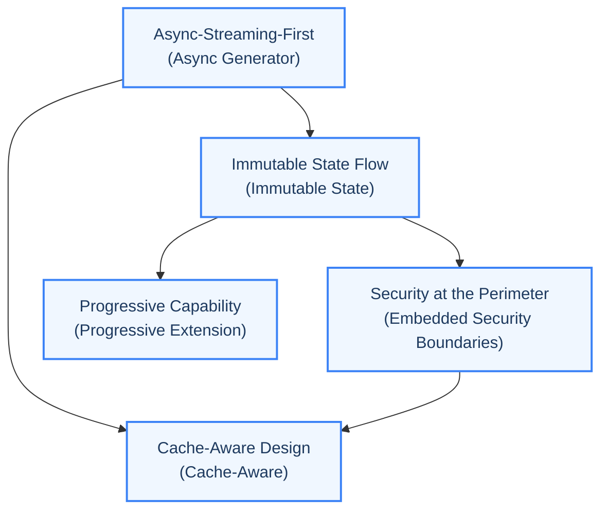

# Chapter 1: The New Paradigm of Agent Programming

> "The rules of thinking are lengthy and fortuitous. They require plenty of thinking of most long duration and deep meditation for a wizard to wrap one's noggin around."

## Learning Objectives

After reading this chapter, you will be able to:

- Understand the evolution of AI Agents from simple conversation to autonomous tool calling
- Establish a core mental model of Agent Harness and grasp its positioning within Agent systems
- Master Claude Code's macro architecture, technology stack choices, and design philosophy
- Distinguish the fundamental differences between "simple API wrappers" and "Agent Harness"
- Understand how the five design principles permeate every subsystem of the Agent system

---

## 1.1 From Chatbot to Agent: A Paradigm Shift in Software Engineering

### LLM as a Reasoning Engine vs. LLM as a Conversational Partner

In 2023, most developers interacted with LLMs like this: open a web page, enter a prompt, and receive a text response. The LLM's role was "conversational partner" -- it understood your question, generated a seemingly reasonable answer, and then waited for your next question. The entire interaction was synchronous, single-turn, and purely text-based.

This mode can be described with a simple model:




The core limitation of this mode is that the LLM can only "speak," not "act." It cannot read your file system, execute test commands, create Git branches, or autonomously adjust its strategy when encountering errors. Every interaction with the outside world requires a human intermediary to manually complete -- copying code to the editor, switching to the terminal to run commands, and then copying the output back to the dialog box. This "human glue" pattern is not only inefficient but also error-prone.

In 2024, a fundamental cognitive shift began to spread: **the true value of LLMs lies not in generating text, but in serving as a reasoning engine to orchestrate tool calls.** When the LLM is no longer merely "the one answering questions" but becomes "the decision hub that determines what tools to call, what parameters to pass, and how to process the returned results," its capability boundaries are completely opened up.

The impact of this cognitive shift is profound. It means the LLM's role transforms from a passive text generator to an active task orchestrator. To use a more vivid analogy: if the previous LLM was a military staff officer who could only dictate instructions, then tool calling turns the LLM into a commander who can directly coordinate various units in combat. The staff officer's instructions need to be relayed by messengers level by level, while the commander's orders can reach every combat unit in milliseconds.

### The Breakthrough Significance of Tool Use

The breakthrough significance of tool calling lies in how it redefines the boundary between LLMs and the outside world:

In a world without tool calling, the LLM is a closed system. Its knowledge is cut off at the last day of its training data, its reasoning is limited to the context window, and its output can only be human-readable text. It is as if you have an extremely knowledgeable friend who is trapped in a room with no windows and no telephone -- they know how to diagnose diseases but cannot use a stethoscope; they know how to repair cars but cannot pick up a wrench.

With tool calling, the LLM becomes an orchestrator of an open system. It can call search engines to obtain real-time information, call code interpreters to perform calculations, call the file system to read and write code, and call Git for version control. Each tool call is a handshake between the LLM and the real world. The friend trapped in the room now has a telephone, a robotic arm, and a connection to the entire internet.

But tool calling also introduces new engineering challenges. These challenges are no longer at the model level, but at the systems engineering level:

1. **Tool Registration and Discovery**: Who manages the tool registry? How does the model know which tools are available? How can new tools be dynamically added without restarting the system?
2. **Parameter Validation**: Who validates the parameters of tool calls? The model may pass incorrectly typed parameters, omit required fields, or pass out-of-range values. At which layer should validation logic reside?
3. **Permission Control**: Who decides whether a particular tool call should be executed? The model might request `rm -rf /`, which obviously should not be allowed. But some operations are safe in specific contexts -- how do you balance security and efficiency?
4. **Error Recovery**: Tool execution may fail, API calls may time out, and the LLM's output may not conform to the expected format. Each error scenario requires a corresponding recovery strategy; otherwise, the Agent will fall into an "error-retry-error again" death loop.
5. **State Consistency**: Multiple tool calls may operate on the same resources. How do you maintain state consistency across multiple rounds of calls? How do you avoid the problem of "reading stale data"?
6. **Concurrency and Scheduling**: Some tool calls can be executed in parallel (such as reading multiple files simultaneously), while others must be serialized (such as creating a directory before writing files). How do you intelligently schedule these calls to maximize efficiency?

These questions gave birth to a new architectural concept: **Agent Harness**.



### Why Agent Harness Instead of Simple Wrappers

A common misconception is that Agent Harness is just a wrapper around the LLM API, plus some tool definitions and calling logic. The reality is far from that.

Let's understand this through a concrete comparison. Suppose we want to build an Agent that can "modify code and run tests":

**The simple wrapper approach** is: call the LLM API, parse the tool call instructions from the output, execute the tools, stitch the results back into the prompt, and call the LLM API again. This is a typical while loop.

The problem with this approach is that it assumes an idealized world: API calls never time out, model output is always correctly formatted, users don't need to see progress in real time, the context window is infinite, and all operations are safe. But in a real production environment, every one of these assumptions will be violated.

**The Agent Harness approach**, on the other hand, needs to consider the following issues:

1. **Streaming Output**: LLM responses are streamed; users need to see the Agent's thinking process in real time rather than waiting for the entire response to complete. How do you implement incremental rendering without blocking the main thread? If you use callbacks, you end up with "callback hell"; if you use Promise chains, you lose the ability to cancel mid-stream; if you use event emitters, you increase the complexity of memory management.

2. **Permission Control**: The LLM might request `rm -rf /`, which obviously should not be allowed. At which layer should the permission system intervene? If you intercept uniformly at the outer layer, you cannot handle tool-specific permission logic (such as risk assessment for Bash commands); if you check inside each tool, you get duplicated code and inconsistent permission policies. How do you balance security and efficiency?

3. **Context Management**: As the conversation progresses, the context window fills up. When should context compression be triggered? How can the compression strategy ensure that critical information is not lost? How does the compressed context coordinate with the caching system? A poor compression strategy may cause the Agent to "forget" critical information, leading to incorrect decisions.

4. **Error Recovery**: Tool execution may fail, API calls may time out, and the LLM's output may not conform to the expected format. Each error scenario needs a corresponding recovery strategy. Without a unified error recovery framework, each error must be handled individually, and the code will quickly bloat to an unmaintainable level.

5. **State Persistence**: How do you recover after a user interrupts a session? How do multiple sub-agents share state? How do you ensure immutability of state updates? If state management is chaotic, the Agent may exhibit inconsistent behavior after recovery.

6. **Extensibility**: How can third-party developers safely register new tools? How do you support external protocols like MCP (Model Context Protocol)? Without clear extension interfaces, the Agent's capabilities will forever be limited by the original developers' imagination.

Each of these issues constitutes an independent engineering challenge. The core value of Agent Harness is providing a unified framework to systematically solve all of these problems.

To use a more vivid analogy to summarize the difference between the two: a simple wrapper is like adding a remote control to a car -- you can make it go forward and backward, but there's no power steering, no braking system, no airbags. Agent Harness is designing an entire safe, reliable, and extensible autonomous vehicle -- not just an engine, but also a suspension system, a braking system, safety restraint systems, and a diagnostic system.

Summarized in one sentence: **Agent Harness is a runtime framework built around an LLM that elevates the LLM from a text generator to an autonomous agent capable of interacting with the outside world safely, reliably, and efficiently.**

> **Anti-Pattern Warning:** If you are building an Agent system and your core loop is just a simple `while (true) { callAPI(); parseResponse(); executeTool(); }` loop, you may be repeating the "simple wrapper" mistake. Stop and think: how does your system handle streaming output? How does it manage context? How does it recover from errors? If the answer to these questions is "haven't figured that out yet," then you need an Agent Harness.

---

## 1.2 Claude Code Panoramic Architecture Overview

Before diving into design philosophy, let's first examine Claude Code's codebase from a macro perspective. The numbers themselves contain a wealth of information.

### AI Programming Tools Evolution Timeline

Before analyzing Claude Code's architecture, let's widen our perspective and look at the evolution of AI programming tools. Understanding this timeline helps us see where Claude Code sits in the technological lineage:



This timeline reveals an important pattern: the direction of AI programming tool evolution has always been "giving LLMs more agency." From only being able to see the current file, to seeing the entire project; from only being able to generate suggestions, to being able to execute commands; from single-step operations to multi-step autonomous planning. Agent Harness is the inevitable architectural product of this evolutionary direction.

### Project Scale: 1,884 TypeScript Files, 512,664 Lines of Code

Claude Code's `src` directory contains 1,884 TypeScript files totaling 512,664 lines of code. What does this scale mean?

For a terminal tool, this size is quite significant. For comparison, VS Code's core codebase is approximately 500,000 lines of TypeScript, and Claude Code as a command-line tool has reached a similar scale. This indicates that the engineering complexity of Agent Harness is no less than that of a complete editor framework.

But this does not mean the code is bloated. On the contrary, Claude Code's code organization exhibits a high degree of modularity: each tool is an independent module, each subsystem has clear boundaries, and the division of responsibilities follows the single responsibility principle. This level of modularity is a key guarantee of Agent Harness maintainability.

Let's use an architectural overview diagram to visually illustrate Claude Code's module organization:



This diagram reveals the layered nature of Claude Code's architecture: from the user entry point at the top to the extension layer at the bottom, each layer has clear responsibilities and interface boundaries. The dialog main loop is the "heart" of the entire system, driving data flow between the various subsystems.

### Technology Stack

Claude Code's technology stack choices embody the engineering philosophy of "using the right tool for the right problem":

| Technology Component | Choice | Design Considerations | Why Not Alternatives |
|---------------------|--------|----------------------|---------------------|
| **Runtime** | Bun | Native TypeScript support, faster startup, native `fetch` API | Node.js requires a compilation step; Deno's ecosystem maturity is insufficient |
| **Terminal UI** | React + Ink | Componentized UI model, declarative rendering, React ecosystem reuse | blessed/ncurses too low-level; raw console.log cannot handle complex layouts |
| **CLI Framework** | Commander.js | Mature command-line argument parsing, subcommand support | yargs is heavier; oclif targets large-scale CLI projects |
| **Schema Validation** | Zod v4 | Runtime type safety, tool input validation, JSON Schema generation | Joi doesn't support type inference; io-ts has a steep learning curve |
| **LLM SDK** | @anthropic-ai/sdk | Anthropic official SDK, streaming response support | Direct fetch lacks type safety and retry logic |

The choice of React + Ink is particularly noteworthy. Ink is a framework that renders terminal UI using the React component model. This means Claude Code's user interface is not pieced together with traditional `console.log` but is declaratively described using a React component tree. This choice brings several benefits: UI state management can leverage React's mature solutions (such as `useState`, `useEffect`), components can be independently tested and reused, and complex UIs (such as tool execution progress bars, multi-column layouts) can be implemented more elegantly.

This choice also reflects an important design philosophy: **terminal UI should not be second-class compared to web UI.** Developers are accustomed to componentized thinking and declarative rendering in web development; bringing these mature patterns into terminal UI development can significantly reduce development and maintenance costs. When you see Claude Code's tool execution progress bars, permission confirmation dialogs, and multi-column result displays, they are all React components underneath -- fundamentally no different from the components you write in web applications.

The choice of Zod v4 is equally noteworthy. In Agent systems, tool call parameters generated by the LLM are unpredictable -- the model may pass incorrectly typed parameters, omit required fields, or pass out-of-range values. Zod provides a type safety barrier at runtime, ensuring every tool call undergoes strict parameter validation. More importantly, Zod can simultaneously generate JSON Schemas that are sent to the API, letting the model know the meaning and constraints of each parameter -- this is the perfect practice of "type definitions as documentation."

### Core Source Files and Their Responsibilities

Claude Code's core architecture can be summarized with five key modules. Understanding the responsibilities and interrelationships of these five modules means grasping Claude Code's macro architecture.

> **Cross-Reference Note:** These five modules will each be analyzed in depth in subsequent chapters. The overview here is intended to establish macro-level understanding; details will be expanded in each dedicated chapter.

#### Entry Point Module

This is the entry point for the entire application, bearing three core responsibilities:

1. **Startup Optimization**: Before all modules are imported, performance probes record startup performance milestones; MDM (Mobile Device Management) configuration reads and macOS Keychain prefetching are launched in parallel, overlapping originally serial I/O operations.
2. **CLI Parsing**: Uses Commander.js to define the command-line interface, handling model selection, allowed tool lists, permission modes, and other parameters.
3. **React/Ink Initialization**: Creates a React rendering context, mounts the root component, and starts the interactive REPL (Read-Eval-Print Loop).

From the entry code, one can observe a carefully designed startup strategy: side-effect imports are ordered to ensure performance analysis probes execute first, followed by parallelizable I/O prefetching, and finally heavyweight module loading. This extreme pursuit of startup performance embodies the terminal tool's "instant-on" design philosophy.

This startup strategy reveals a universal engineering principle: **the startup path is the user's first impression.** A tool that takes 5 seconds to display a prompt versus one that responds in 0.5 seconds creates a world of difference in the user's mind -- "heavy tool" versus "lightweight tool." Claude Code compresses startup time to an imperceptible level through parallel prefetching, lazy loading, and performance probes.

#### LLM Query Engine Core

`QueryEngine` is a class that owns the query lifecycle and session state, managing core data such as dialog message history, file cache, usage statistics, and permission denial records. It is the "lifecycle manager" of the conversation.

The engine is designed to serve both interactive REPL and headless SDK runtime modes, reflecting architectural versatility considerations. By encapsulating the core query logic in an independent class, different runtime environments can share the same set of state management and lifecycle control code.

This "one core, multiple entry points" design pattern is very valuable in engineering practice. Imagine if the interactive REPL and SDK modes used two different sets of query logic -- every time you fixed a bug or added a feature, you'd need to make synchronized changes in two places. The QueryEngine design ensures that whether users interact through the terminal or through API calls, they follow the same verified core path.

#### Async Generator Dialog Main Loop

This is one of Claude Code's most core and most sophisticated modules. The dialog main loop is an `AsyncGenerator` that implements an iterative dialog process, delegating to the internal loop function via `yield*`. In each iteration, the loop performs the following steps:

1. Constructs the API request (system prompt + message history + tool definitions)
2. Calls the LLM API and receives streaming responses
3. Parses tool call instructions from the response
4. Validates each tool call through the permission pipeline
5. Executes the allowed tool calls
6. Injects tool results as new messages into the history
7. Decides whether to continue the loop (if the LLM returned new tool calls) or terminate (if the LLM returned a pure text response)

The key benefit of using `AsyncGenerator` instead of a regular function is that the caller can receive intermediate states (such as streaming text, tool execution progress) at each step via `yield`, without needing callbacks or event emitters. This allows upper-layer code to elegantly consume the entire dialog process using the `for await...of` syntax.

> **Cross-Reference:** Chapter 2 will provide an in-depth analysis of this async generator's internal implementation, including the preprocessing pipeline, state transition model, and dependency injection design.

In terms of state management, cross-iteration state is encapsulated in an immutable State object, updated through wholesale replacement rather than field-by-field modification in each iteration. This immutable state flow pattern makes every state change traceable.

#### Tool Type System Foundation

The tool type module defines the type contract that all tools in Claude Code must follow. This is a classic case of "interface as architecture" -- by defining clear type interfaces, the architectural constraints of the tool system are enforced by the compiler.

This type definition contains rich architectural decisions:

- The tool's execution method receives a permission check callback, meaning permission checking is embedded within the tool execution flow rather than intercepted externally.
- Progress callbacks support incremental progress reporting during tool execution, which is the foundation for streaming UI.
- Concurrency safety declarations mark whether a tool can be executed in parallel, affecting scheduling strategy.
- Interrupt behavior defines what happens when the user interrupts (cancel or block), a key detail for user experience.
- Destructive flags identify whether a tool performs irreversible operations, an important input for the permission system.

> **Cross-Reference:** Chapter 3 will provide a detailed analysis of the tool type system's design, including the `buildTool` factory function, concurrency partitioning strategy, and StreamingToolExecutor.

#### Tool Registry

The core function in the tool registration module returns the complete list of all available tools and is the "Single Source of Truth" for the tool system. Noteworthy design details include:

1. **Conditional Registration**: Some tools are controlled by Feature Flags, such as REPL tools only available in internal builds, and scheduled task tools only enabled under specific feature modes. This allows the same codebase to serve different product forms.
2. **Lazy Loading**: Some tools use dynamic imports instead of static imports to avoid circular dependencies and reduce startup time.
3. **Tool Filtering**: The tool filtering function, before sending the tool list to the LLM, filters out forbidden tools based on the permission context, ensuring the model cannot even "see" tools it should not use.

The combination of conditional registration and lazy loading embodies the "load on demand" engineering philosophy. In Agent systems, the number of tools can reach dozens or even hundreds (especially after MCP protocol extension). If all tools were loaded at startup, it would not only slow down startup but also potentially cause initialization errors due to circular dependencies. Claude Code's approach ensures that only the tools actually needed are loaded into memory.

---

## 1.3 Five Principles of Agent Harness Design Philosophy

By reading Claude Code's architecture, we can distill five design principles that run throughout. These principles are not isolated techniques but rather a mutually reinforcing network of architectural decisions. Each principle answers a core "why": why not choose a simpler approach? What would happen if we didn't design it this way?



### Principle One: Async-Streaming-First

Claude Code's entire dialog loop is built on `AsyncGenerator`. This is not a casual technology choice but a profound architectural decision.

Traditional LLM calls typically use a request-response pattern: send a prompt, wait for the complete response, process the result. But the Agent's interaction pattern is fundamentally different -- an Agent may execute multiple rounds of tool calls in a single user request, and each round may produce intermediate states (thinking process, tool call plans, execution progress) that need to be displayed to the user in real time.

`AsyncGenerator` perfectly matches this need:

- **Incremental Output**: Through `yield`, streaming events are produced step by step, and upper-layer code can render them in real time.
- **Interruptibility**: The caller can terminate the generator at any time via `generator.return()` or `generator.throw()`.
- **Backpressure Control**: If the consumer cannot keep up with the producer, the generator automatically pauses, avoiding memory overflow.

This design makes Claude Code's dialog loop an "event stream" rather than a "request-response pair." Upper-layer code only needs a `for await...of` loop to consume all events from the entire dialog process.

**What if we didn't design it this way?** If we used a callback pattern, every new event type would require registering a new callback function. As event types increase, the code would become an unmaintainable "callback hell." If we used Promise chains, although callback hell is solved, the ability to cancel mid-stream is lost -- when the user presses Ctrl+C, there's no way to gracefully stop the ongoing API call. If we used EventEmitter, although cancellation is solved, it introduces memory leak risks (forgetting to remove listeners) and type safety issues (event names are strings).

AsyncGenerator is the only solution that simultaneously satisfies all three requirements: "streaming output," "cancellable," and "type-safe."

### Principle Two: Security at the Perimeter

Claude Code's permission system is not an add-on security layer; it is embedded into the core pipeline of the architecture. From the moment a tool call is proposed by the LLM to its final execution, it must pass through multiple security checkpoints:

1. **Tool Visibility Filtering**: Before sending the tool list to the LLM, forbidden tools are filtered out based on permission rules. The model cannot even "see" tools it should not use.
2. **Input Validation**: The tool's `validateInput` method executes before the permission check, rejecting parameters with invalid formats.
3. **Permission Decision**: The `canUseTool` callback comprehensively considers the permission mode (default/Auto/Bypass), the tool's danger level, the user's historical decisions, and other factors to make an allow/deny/ask decision.
4. **Runtime Protection**: Even after passing the above checks, tool execution still has sandbox restrictions, timeout controls, output size limits, and other protective measures.

The design philosophy of this four-stage pipeline is "Defense in Depth" -- no single security checkpoint is a "silver bullet," but each layer can independently short-circuit and block unsafe operations.

**Why not use a simple allowlist?** The allowlist approach seems simple but has a fatal flaw: it assumes all operations can be pre-classified as "safe" or "unsafe." In reality, security is context-dependent -- `rm -rf node_modules` is safe in a development environment, but `rm -rf /etc` is dangerous. The same Bash tool and the same command pattern have completely different risk levels under different parameters. The four-stage pipeline allows each layer to make more fine-grained judgments based on context.

> **Cross-Reference:** Chapter 4 will provide an in-depth analysis of the four stages of the permission pipeline, including rule matching priority, classifier auto-approval, and permission persistence mechanisms.

### Principle Three: Cache-Aware Architecture

In the LLM API pricing model, Prompt Caching can significantly reduce costs and latency. Claude Code's architecture considers cache friendliness at multiple levels:

- **System Prompt Stability**: The construction method of the system prompt is carefully designed to ensure that when the tool list is unchanged, the byte content of the prompt remains consistent, thereby hitting the API-side prompt cache.
- **Sub-Agent Cache Sharing**: Sub-agents in Fork mode inherit the parent agent's `renderedSystemPrompt`, avoiding regeneration of prompts that might differ due to configuration changes, ensuring cache hit rates.
- **Message History Immutability**: Messages already sent to the API are never modified; only new messages are appended, ensuring cache key stability.

The impact of cache-aware design is profound: it not only reduces API costs but also improves response speed by reducing redundant computation, which is particularly critical for Agent systems that need to interact with LLMs frequently.

**What if we didn't design it this way?** An Agent system that doesn't care about caching might rebuild the system prompt on every API call, leading to: (1) every API call needing to process the full prompt, increasing latency and cost; (2) minor configuration changes (such as tool list reordering) potentially causing complete cache invalidation; (3) in sub-agent scenarios, parent and child agents being unable to share cached prompts, leading to redundant computation. For a production-grade Agent making hundreds of API calls per day, these wastes quickly accumulate into significant costs.

### Principle Four: Progressive Capability Extension

Claude Code provides a four-level extension model, from built-in to external, from simple to complex:

| Extension Level | Mechanism | Use Cases | Extender Role |
|----------------|-----------|-----------|--------------|
| **Tool** | Implement the `Tool` type interface | Add new atomic operation capabilities | Core developers |
| **Skill** | Declarative tool via Markdown + scripts | Encapsulate reusable task templates | Advanced users |
| **Plugin** | Lifecycle-equipped toolkits | Organize related tools and configurations | Ecosystem developers |
| **MCP Server** | Standardized protocol for external tool integration | Third-party tool ecosystem | Third-party developers |

The design philosophy of this four-level extension model is "progressive enhancement": for simple needs, declaring a Skill suffices; for complex integrations, you can connect external services through the MCP protocol. Each level builds on the previous one rather than replacing it.

Particularly noteworthy is the MCP (Model Context Protocol) integration approach. Claude Code is not a closed system -- through the MCP protocol, it can dynamically discover and call tools provided by external tool servers, meaning the Agent's capability boundaries are not preset by developers but can be dynamically extended at runtime.

**What if progressive extension were not adopted?** Both extremes are undesirable. If only the "Tool" level of extension were available, third-party developers would have to modify core code to add new capabilities, severely limiting ecosystem growth. If only the MCP level of extension were provided, even simple customization needs would require building a complete tool server, setting the barrier too high. Progressive extension allows every type of contributor to work at the abstraction level most suitable for them.

> **Cross-Reference:** Part 3 will provide detailed coverage of MCP protocol integration, plugin system design, and Skill declarative tool definitions.

### Principle Five: Immutable State Flow

Claude Code's state management draws on the immutable state patterns of Redux/Zustand. The core state store is implemented by a minimal store implementation. This implementation, while concise, contains important design decisions:

- **Updater Function Pattern**: State updates receive a `(prev: T) => T` function rather than the new state value itself. This ensures that every state update is based on the previous state, avoiding race conditions.
- **Reference Equality Check**: Reference comparison ensures notifications are triggered only when actual changes occur, avoiding unnecessary re-renders.
- **Subscribe/Unsubscribe Pattern**: Listeners are managed through a collection, with cleanup functions returned to prevent memory leaks.

At the dialog loop level, immutability is strictly maintained: cross-iteration state is updated through wholesale replacement, and at the start of each iteration, needed fields are destructured from the state object, ensuring read operations use immutable snapshots.

The benefits of immutable state flow are manifold: state changes are predictable, traceable, and debuggable; in sub-agent scenarios, the parent agent can safely pass state snapshots to child agents without worrying about accidental modification; in speculative execution scenarios, state rollback becomes simple and safe.

**What if we didn't design it this way?** If mutable state were used (directly modifying object fields), the classic race condition would appear in concurrent scenarios: tool A's execution modifies state, but tool B reads partially modified, inconsistent data. In sub-agent scenarios it's even more dangerous -- a child agent might accidentally modify the parent agent's state, causing the main loop's behavior to become unpredictable. These types of bugs are extremely difficult to reproduce and debug because they depend on the specific scheduling order of asynchronous operations.

---

## Hands-On Exercise: Installation and Initial Diagnosis

Before diving into architectural details, let's build an intuitive feel for the Claude Code runtime through a simple exercise. These exercises are arranged in increasing difficulty, each corresponding to a core concept discussed in this chapter.

### Step 1: Install Claude Code

Make sure your system has Node.js 18+ or Bun installed, then run:

```bash
npm install -g @anthropic-ai/claude-code
```

After installation completes, verify the version:

```bash
claude --version
```

> **Best Practice:** We recommend that in addition to global installation, you also use Claude Code in specific projects via `npx` or project-local installation. This ensures different projects can use different versions of Claude Code without conflicts.

### Step 2: Run the `/doctor` Diagnostic Command

Navigate to any project directory in your terminal, start Claude Code, and enter `/doctor`:

```bash
cd your-project
claude
> /doctor
```

The `/doctor` command executes a series of system self-checks, including:

1. **Environment Check**: Node.js version, Bun availability, Git installation status
2. **Permission Configuration Check**: Current permission mode, tool allowlist/blocklist status
3. **MCP Server Connection Status**: Whether configured MCP servers are responding normally
4. **API Connectivity Check**: Whether the connection to the Anthropic API is normal
5. **File System Access Check**: Read/write permissions for the working directory

### Step 3: Observe the System Self-Check Process

While `/doctor` is running, observe the following phenomena:

- System checks execute **progressively** -- as each check completes, the result is immediately displayed rather than waiting for all checks to finish before outputting everything at once. This is precisely the "async-streaming-first" principle manifesting in everyday functionality.
- Some checks (such as API connectivity) may request your confirmation, which is the practice of the "embedded security boundaries" principle -- even diagnostic operations must pass through the permission pipeline.
- Check results may show cache hit status (if applicable), which is one aspect of "cache-aware design."

### Step 4: Observe a Complete Tool Call

Try sending a simple request to Claude Code, such as "list all TypeScript files in the current directory." Observe the following process:

1. **Thinking Phase**: Claude Code displays its thinking process, explaining which tool it intends to use.
2. **Tool Call Phase**: You will see the tool name and parameters (such as `GlobTool("*.ts")`), along with execution results.
3. **Response Phase**: Based on the tool results, Claude Code provides its final response.

Behind this simple interaction lies the "dialog main loop" we described in Section 1.2 at work. Try to mentally trace each step to the corresponding architectural module.

### Step 5: Reflection Questions

1. Among the tool calls you observed, which tools are concurrency-safe? Which are not? Why?
2. If you press Ctrl+C to interrupt an operation, how does the system respond? Which design principle does this embody?
3. If you send 50 messages in a row, what happens to the context window? How should the system handle this? Which design principle does this mechanism correspond to?

---

## Key Takeaways

This chapter establishes the conceptual framework for understanding Claude Code. Here are the core points:

1. **The paradigm shift has happened**: AI programming assistants are evolving from "conversational partners" to "autonomous agents." The core driver of this shift is the standardization of tool calling capabilities, and Agent Harness is the engineering infrastructure that makes this shift possible. Understanding this means understanding why simple wrappers are not enough -- Agents need not just "API calls" but an entire runtime environment.

2. **Agent Harness is a complex engineering system**: Claude Code's scale of over 510,000 lines of code demonstrates that building a reliable Agent is far more involved than "calling the LLM API + executing tools." Streaming output, permission control, context management, error recovery, state persistence, and extensibility -- each is an independent engineering challenge. These challenges will not disappear as models become more powerful -- on the contrary, as Agents execute more complex tasks, these engineering issues will become even more acute.

3. **Five core modules define the architectural skeleton**: Entry module, query engine, dialog loop, tool types, and tool registry. Understanding the responsibilities and interrelationships of these five modules means grasping Claude Code's macro architecture. Their relationship is a strict layered calling relationship: the entry module creates the query engine, the query engine drives the dialog loop, the dialog loop uses the tool system, and the tool system is managed by the tool registry.

4. **The five design principles are the thread running through everything**: Async-streaming-first, embedded security boundaries, cache-aware design, progressive capability extension, and immutable state flow -- these five principles are not isolated design points but a mutually reinforcing network of architectural decisions. In subsequent chapters, we will repeatedly see them embodied in specific subsystems. Whenever you encounter a "why is it designed this way" question, the answer can almost always be traced back to one of these five principles.

In the next chapter, we will dive into the internals of the dialog main loop, progressively analyzing that sophisticated AsyncGenerator dialog loop to understand how the Agent autonomously advances tasks through the cycle of "call LLM - parse tool calls - execute tools - inject results." This is the most core chapter in the book -- because the dialog main loop is the "heart" of Agent Harness, and understanding it means understanding the Agent's "pulse."
