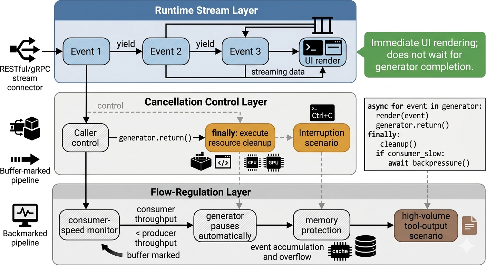
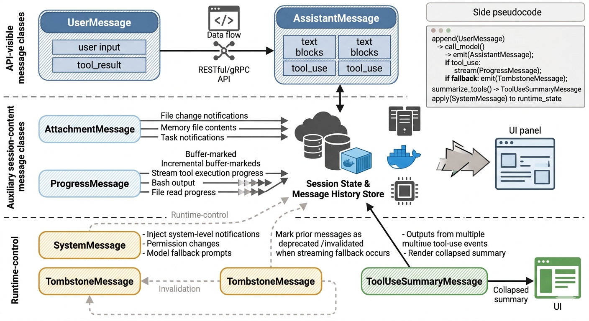
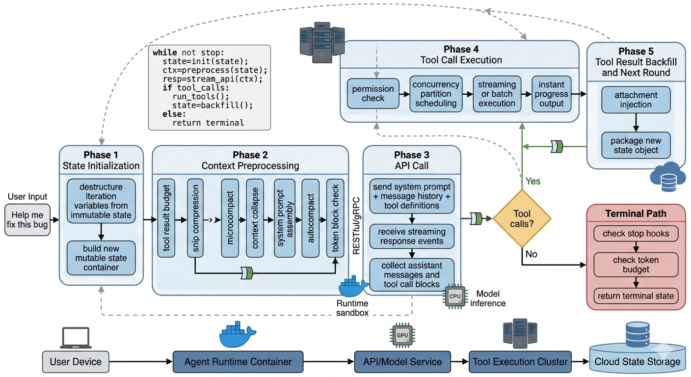
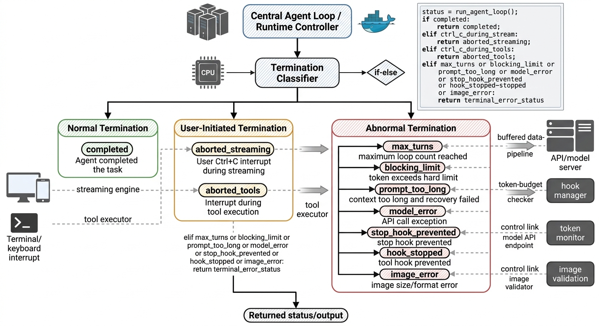
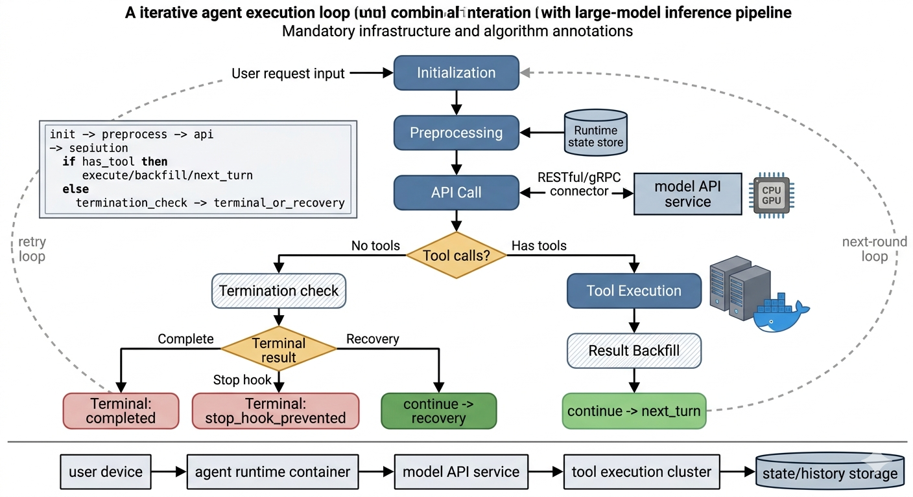

# Chapter 2: The Dialog Loop -- The Agent's Heartbeat

> "The truth is like a lion. You don't have to defend it. Let it loose. It will defend itself."
> -- Augustine of Hippo

**Learning Objectives:** After reading this chapter, you will be able to:

- Deeply understand the async-generator-driven dialog main loop mechanism
- Master the complete state transition model of Agent-model interaction
- Understand the design principles of the preprocessing pipeline (Snip, Microcompact, Context Collapse, Autocompact)
- Analyze the trigger conditions and recovery strategies for seven Continue paths
- Evaluate the impact of the dependency injection pattern on test maintainability

---

## 2.1 Async Generators: The Skeleton of the Dialog Loop

Claude Code's dialog main loop is an async generator defined with `async function*`. It is not a regular function that executes to completion in one shot, but rather a "living" process that can be paused, resumed, and cancelled. Each `yield` is like a heartbeat pulse, pushing streaming events to the caller.

This design choice deserves more space to fully understand. In traditional programming models, function calls are synchronous: the caller initiates a request, the callee performs a computation, and returns a result. But the Agent's interaction pattern breaks this synchronous assumption -- the model may take tens of seconds to complete a response, and responses arrive token by token; tool execution may take minutes, during which real-time progress feedback is needed; the user may interrupt the operation at any time, demanding an immediate stop.

Faced with these requirements, the traditional function call model falls short. Async generators provide the perfect answer: they act like a "coroutine" that can be paused and resumed at any time, establishing a real-time event pipeline between the "producer" (the dialog loop) and the "consumer" (the UI rendering layer).

### Function Signature and the AsyncGenerator Pattern

The entry point for the entire dialog loop is an exported async generator function that accepts a parameter object, can yield five types of events (streaming events, request start events, messages, tombstone messages, and tool call summaries), and ultimately returns an object representing the dialog's terminal state.

This function signature encapsulates three layers of design decisions:

1. **Union of Yielded Types**: The generator can yield five types of events -- streaming token arrival events, API request start events, user/assistant/system messages, tombstone messages that mark deprecated messages, and tool call summary messages. These five event types cover all information that needs to be communicated to the UI layer during the dialog process. Using a union type rather than multiple independent generators ensures temporal consistency of events -- the order of events seen by the UI is exactly the same as the order they were produced.

2. **Terminal Return Type**: The generator ultimately returns a terminal state object indicating the reason the dialog ended. The caller consumes the event stream via `for await (... of query(...))`, and when the loop ends naturally, the generator's `return` value is the termination reason. This "yield process, return conclusion" pattern allows upper-layer code to cleanly separate "in-process handling" from "post-completion cleanup."

3. **Parameter Object**: All input parameters are encapsulated in a single structured object rather than positional parameters, allowing the caller to provide fields as needed. Key fields include message history, system prompt, permission check function, tool execution context, maximum loop count, and so on.

Why choose AsyncGenerator over callbacks or Promises? Because generators naturally fit the "streaming produce - streaming consume" model. Model responses arrive token by token, tool execution results are produced step by step, and the generator's `yield` mechanism allows each layer to "push when data is available, wait when it's not," without callback hell or Promise chains.

> **Design Philosophy Comparison:** If you use a callback pattern, you need to register independent callback functions for each event type, and the code becomes scattered callback handling logic. If you use Promise chains, although callback hell is avoided, Promises are "one-shot" -- they can only resolve once and cannot express a continuous event stream. If you use RxJS Observables, while powerful, they introduce a heavy dependency and a steep learning curve. AsyncGenerator is the "just right" solution -- native language support, zero extra dependencies, type-safe, and naturally supports streaming and cancellation.

### Streaming Event Types

The events flowing through the dialog loop can be categorized as follows. Together they form the "heartbeat signals" of the dialog process:

- **stream_request_start**: Emitted before each API request begins, informing the UI layer that a new request is about to be made. This event is emitted at the beginning of each loop iteration. Its practical value is that the UI can display a "thinking..." status indicator.

- **StreamEvent**: Raw streaming events from the Anthropic API, including text block deltas (`content_block_delta`), thinking blocks, tool_use blocks, and so on. These events are passed through directly from the API response stream to the UI. Imagine watching a live broadcast -- StreamEvent is each frame in the video stream, and the UI layer is responsible for stitching these frames into a smooth video.

- **Message**: Structured message objects, including `AssistantMessage` (assistant replies, possibly containing tool_use blocks), `UserMessage` (user input or tool_result), `SystemMessage` (system notifications), and so on. Unlike StreamEvent, Messages are parsed and structured -- like a replay after the live broadcast ends, where the footage has been edited and organized.

- **TombstoneMessage**: When streaming fallback occurs, some previously produced messages need to be marked as deprecated. Tombstone messages tell the UI to remove the corresponding historical messages. The name comes from the "tombstone marker" pattern familiar to programmers -- just as a tombstone marks the end of a life, TombstoneMessage marks a message's "invalidation."

- **ToolUseSummaryMessage**: After a batch of tool executions completes, an asynchronously generated brief summary used for collapsed display of tool call results in the UI. This is especially important for long Agent sessions -- without summaries, the complete output from dozens of tool calls would overwhelm the screen.

### Message Type System

Claude Code's messaging system defines clear role divisions. The core message types include:

- **UserMessage**: The user's input message, which also carries tool execution results (tool_result). From the API's perspective, tool results are always sent with the user role. This design may seem counterintuitive -- why are tool results in the "user" role? The reason is that at the API protocol level there are only three roles (system/user/assistant), and tool results need to be "seen" by the model, so they must be sent in the user role. This is a classic case of an engineering constraint driving a design decision.
- **AssistantMessage**: The message returned by the model, which may contain text blocks and tool_use blocks. When the model detects that a tool needs to be called, the response will include a content block with `type: 'tool_use'`. A key characteristic of AssistantMessage is that it may simultaneously contain text and tool calls -- the model might first output an explanation ("Let me check your package.json file"), then append a tool call. This "talking while doing" pattern makes the Agent's behavior more transparent.
- **SystemMessage**: System-level notifications, such as permission changes, model fallback prompts, and so on. Does not participate in API communication; only displayed in the UI. SystemMessage is the "fourth wall" -- it doesn't participate in the model conversation but tells the user what's happening inside the system.
- **AttachmentMessage**: Attachment messages carrying file change notifications, memory file (CLAUDE.md) contents, task notifications, and other supplementary information.
- **ProgressMessage**: Progress messages for tool execution, used for real-time feedback on tool running status (such as Bash command output streams, file read progress, etc.).

> **Cross-Reference:** Message types are closely related to the tool rendering methods in Chapter 3. Each tool definition's `renderToolUseMessage`, `renderToolResultMessage`, and other methods determine how different message types are visually presented in the terminal.

---

## 2.2 The Lifecycle of a Complete Turn

Now let's follow a complete Turn -- from the user pressing the Enter key to the model completing its response or deciding to call a tool -- to understand the complete flow inside the `queryLoop` function.

Using a medical analogy, a Turn is like a complete diagnostic process: the doctor (model) first reviews the medical record (context preprocessing), then communicates with the patient (API call), may need to order tests (tool calls), and after receiving the test results (tool execution), makes a diagnosis (final response). If the test results are insufficient for a diagnosis, the doctor orders more tests (next loop iteration).

### Phase 1: State Initialization

`queryLoop` is a `while(true)` infinite loop. Each iteration represents a complete round of "model call + tool execution." At the top of the loop, the function destructures the variables needed for the current iteration from the state object, including tool usage context, message list, auto-compaction tracking, recovery counters, and so on.

The state object is a mutable state container holding all state passed across iterations: message list, tool context, auto-compaction tracking, recovery counters, turn count, and so on. Each time `continue` returns to the top of the loop, a new state object is written.

The key insight of this design is: **there is a clear boundary between "read" and "write" for state.** At the beginning of each iteration, the function reads all needed state fields at once through destructuring (snapshot semantics); at the end of the iteration, it writes the updated state at once by constructing a new object (atomic update semantics). This avoids inconsistency issues from partial updates during iteration.

### Phase 2: Context Preprocessing

Before calling the model, the loop executes a series of preprocessing steps. These steps form a carefully designed "compression pipeline" aimed at preserving the most valuable information within a limited context window:

1. **Tool Result Budget**: Truncates or persists overly large tool results to disk, ensuring the context window limit is not exceeded. This is similar to the "paging" mechanism in computer science -- when data is too large to fit entirely in memory (the context window), some data is stored to disk, retaining only a summary or reference.

2. **Snip Compression**: If history trimming is enabled, overly long history messages are trimmed. Snip is the most "brutal" compression method -- it directly truncates message content. It is typically used to handle excessively long output from tools (such as the complete contents of large files).

3. **Microcompact**: Performs lightweight compression before auto-compaction, using cached editing techniques to reduce token consumption. The elegance of Microcompact lies in being "cache-friendly" -- it tries to reuse tokens already cached on the API side, avoiding complete cache invalidation caused by compression.

4. **Context Collapse**: A more fine-grained compression strategy that collapses consecutive messages into a compact view without losing information. You can think of Context Collapse as folding acknowledgments like "hello," "okay," "I understand" in a conversation into a single line -- the information is preserved, but it takes up less space.

5. **System Prompt Assembly**: Merges the base system prompt with dynamic context (such as current working directory, user configuration, etc.) into the complete system prompt. The design of this step directly impacts cache hit rates -- if the assembly order is unstable, the byte content of the prompt may differ on each call, causing cache invalidation.

6. **Autocompact**: If the context exceeds the threshold, the auto-compaction mechanism is triggered, summarizing the conversation history into a compressed message and then replacing the message list to be sent. Autocompact is the "last line of defense" of the compression pipeline -- when other lightweight compression methods cannot reduce the context below the limit, it performs a full summary.

7. **Token Block Check**: If the token count exceeds a hard limit, an error message is returned directly without making an API call. This is a "fail fast" mechanism -- rather than sending an API request doomed to fail, it's better to block it locally.

> **Best Practice:** The design of this seven-step pipeline follows an important principle: **compression methods are arranged from lightweight to heavyweight, and each step tries the lowest-cost approach first.** This principle is worth following when building your own Agent system -- first use Snip to trim overly long content, then use Microcompact to reduce cache waste, then use Context Collapse to fold redundant information, and only finally use Autocompact for a full summary. Because each step loses some information, you should delay using the most "aggressive" compression methods as long as possible.

### Phase 3: API Call

After all preprocessing is complete, the core API call phase begins. Here, the injected model-calling dependency is used to initiate a streaming request, passing the assembled message list, system prompt, and tool definitions to the model API. The model calling function returns an async generator that produces streaming events one by one. Each time an event is received, the loop executes the following logic:

- If the event contains an assistant message, add it to the assistant message array.
- If the event contains tool call blocks, collect them and flag that subsequent tool execution is needed.
- If streaming tool execution is enabled, start executing tools immediately upon receiving tool call blocks, without waiting for the entire response to complete.

A subtlety of this phase is that the model may include both text content and tool calls in a single response. For example, the model might first output "Let me check your package.json file," then append a Read tool call. The loop must correctly handle this mixed output -- both yielding text events for UI rendering and collecting tool call blocks for subsequent execution.

### Phase 4: Tool Call Detection and Execution

After the streaming response ends, the loop checks whether tools need to be executed. If the model did not request any tool calls, it enters the termination path, checks various exit conditions (stop hooks, token budget, etc.), and returns.

If the model did request tool calls, the loop executes the tools: depending on whether streaming execution is enabled, it either gets remaining results from the streaming executor or uses the traditional batch execution function.

> **Cross-Reference:** The detailed mechanisms of tool execution (concurrency partitioning, streaming executor, state machine) are analyzed in depth in the Tool Orchestration Engine section of Chapter 3.

Tool execution is also an async generator. For each result message produced, the loop yields it to the upper-level consumer (UI) while also collecting it into the tool results array.

This design embodies an important engineering principle: **"result collection" and "result passing" are decoupled.** Tool results are both collected into an array for the next API call and yielded to the UI for real-time display. These two concerns are accomplished simultaneously through the same yield operation, avoiding additional state synchronization logic.

### Phase 5: Tool Result Backfill and Next Round

After tool execution completes, the loop performs attachment injection (memory files, file change notifications, queued commands, etc.), then packages all messages (original messages + assistant messages + tool results) into a new state object and returns to the top of the `while(true)` via `continue`.

The next iteration will use this expanded message list to call the model again. The model will see the previous tool results and then decide whether to continue calling tools or provide a final response.

Attachment injection is an easily overlooked but very important step. Imagine this scenario: during tool execution, the user modifies the CLAUDE.md file. Without injecting this change, the model might make decisions based on stale configuration in the next call. Attachment injection ensures that at the start of each loop iteration, the model has the latest environment information.

### Termination Condition Judgment

The dialog loop's termination occurs at multiple points, with each termination reason corresponding to different system states and cleanup logic:

| Termination Reason | Trigger Condition | User Experience | Design Intent |
|--------------------|-------------------|-----------------|---------------|
| `completed` | Model responds normally with no tool calls | Agent gives final response | Normal "successful completion" path |
| `aborted_streaming` | User interrupt (Ctrl+C) | Operation stops immediately | User-initiated interrupt requiring instant response |
| `aborted_tools` | Interrupt during tool execution | Current tool cancelled, results discarded | Tool execution may be lengthy, interrupt support needed |
| `max_turns` | Maximum loop count reached | Agent stops and explains why | Prevent infinite loops consuming tokens |
| `blocking_limit` | Token count exceeds hard limit | Agent reports error and exits | Hard safety boundary, prevents API errors |
| `prompt_too_long` | Context too long and recovery failed | Agent reports error and exits | All compression methods exhausted |
| `model_error` | API call exception | Agent reports error and displays error message | Graceful degradation for network or server issues |
| `stop_hook_prevented` | Stop hook prevented continuation | Agent stops and explains why | User-configured auto-stop condition |
| `hook_stopped` | Tool hook prevented continuation | Agent stops and explains why | Decision from external Hook script |
| `image_error` | Image size/format error | Agent reports error and exits | Input data format issue |

> **Design Insight:** The fine-grained classification of ten termination reasons is not over-engineering. When debugging Agent behavior, the accurate termination reason is the first clue for identifying problems. If all errors return a generic "error," developers would have no way to determine whether the issue was an API timeout, context overflow, or user interrupt. Fine-grained termination reasons are the foundation of "observability."

These termination reasons can also be categorized into three groups:

- **Normal Termination**: `completed` -- the Agent completed the task
- **User-Initiated Termination**: `aborted_streaming`, `aborted_tools` -- the user decided to stop
- **Abnormal Termination**: the remaining seven -- the system encountered a situation where it could not continue

For abnormal termination, the system performs cleanup logic before returning the terminal state: cancelling tools in execution, releasing resource references, logging the termination reason. This cleanup logic ensures that even if the Agent exits abnormally, it won't leave behind "dirty" state.

---

## 2.3 Dependency Injection and Testability

### The QueryDeps Interface

One of the most notable engineering decisions in the dialog main loop's design is the dependency injection pattern. The system defines a minimal dependency interface containing four core dependencies: the model calling function, the lightweight compression function, the auto-compaction function, and the UUID generator.

The production dependency implementation returns real API calls, compression logic, and random UUID generation.

In the main loop, dependencies are obtained via parameters, falling back to production defaults if not provided. During testing, callers can pass in custom dependency objects, replacing the real API calls, compression logic, and UUID generation. As the design comment states:

> "Passing a deps override into QueryParams lets tests inject fakes directly instead of spyOn-per-module -- the most common mocks (callModel, autocompact) are each spied in 6-8 test files today with module-import-and-spy boilerplate."

This comment reveals an important engineering insight: without dependency injection, test code needs to replace external dependencies through module-level spy/mock. This spy-per-module pattern has several problems: it couples test code to module internal structure, requiring synchronized changes when modules are renamed or moved; it repeats the same mock boilerplate code across multiple test files; and it may cause state leakage between tests due to module caching.

Dependency injection elegantly solves these problems: tests only need to pass in a custom dependency object, without caring about module internal structure; each test case creates an independent dependency instance, avoiding state leakage; the dependency interface is explicit, and when the interface changes, the compiler points out which tests need updating.

### Why the Dialog Loop Uses a Functional Design

Claude Code's dialog loop chooses `async function*` over a class, and this choice has deep reasoning behind it:

1. **Natural State Isolation**: Each call to the dialog function creates a brand-new closure, and all mutable state is local to the function. There is no risk of cross-call state leakage. Contrast with a class approach: if the dialog loop were a method on a class, multiple concurrent dialog instances might accidentally share properties on the class instance, leading to state pollution.

2. **Generator Backpressure Semantics**: `yield` pauses execution until the consumer requests the next value. This means if the UI layer can't keep up with the production speed, the generator automatically pauses without accumulating memory. This is a concern production systems must address -- when tool execution produces large amounts of output (such as the full `npm install` log), a system without backpressure control could crash from memory accumulation.

3. **Cancellation Propagation**: JavaScript generators have a `.return()` method; calling it triggers the generator's finally block and cleans up resources. Combined with resource management declarations, cleanup logic becomes deterministic. This means when the user presses Ctrl+C, not only can the dialog loop be stopped, but all executing tools are properly cancelled and all temporary resources are cleaned up.

4. **Composability**: The `yield*` delegation syntax allows sub-generator output to be forwarded directly. The main loop's results are passed to the outer generator through delegation syntax, and tool execution is chained through the same mechanism. This "generator chain" pattern allows code at different levels to compose seamlessly -- the dialog loop produces events, tool execution also produces events, and the upper-level UI only needs a single unified `for await...of` loop to consume events from all levels.

> **Anti-Pattern Warning:** If you are building your own Agent loop, avoid storing dialog state in global variables or class instance properties. Global state makes concurrent testing impossible; class instance state allows multiple dialog instances to interfere with each other. Function closures are the safest state container -- they are naturally isolated and naturally unshareable.

---

## 2.4 State Transition Model

### State Type and Continue/Terminal

The dialog loop's core state machine is driven by two concepts: mutable loop state (State) and termination signals (Terminal).

The State type defines the loop's complete mutable state, including the message list, tool usage context, auto-compaction tracking state, output token recovery counter, whether reactive compression has been attempted, output token override limit, pending tool summaries, whether stop hooks are active, turn count, and the reason for the last continue. Each time `continue` returns to the top of the loop, a brand-new state object is constructed. The `transition` field records the reason for the last continue, used in recovery logic to avoid re-executing the same recovery path.

Terminal and Continue types are defined in a separate module. Terminal marks the dialog's termination (carrying a reason field), while Continue marks the decision to continue the loop (carrying a reason and optional additional information).

The elegance of this three-element model (State + Continue + Terminal) lies in how the type system enforces loop correctness:

- State is a "mutable but controlled" data container, with a new instance created each continue
- Continue is a "continue" signal, carrying the reason and additional information, guiding the behavior of the next iteration
- Terminal is a "terminate" signal, carrying the reason, ending the loop and returning to the caller

### State Transition Decision Logic

The entire loop's state transitions can be summarized in the following state machine:

Key transition paths include:

1. **next_turn**: Normal continuation after tool calls. The message list is expanded to the original messages plus assistant messages and tool results, and the turn count is incremented. This is the most common and simplest transition path.

2. **max_output_tokens_recovery**: When model output is truncated, a recovery message is injected and the loop continues. The recovery message instructs the model to continue from the truncation point. Maximum 3 retries. This path exists because LLMs are sometimes truncated by the API when output is too long -- not an error, but the model "said too much." The recovery message is equivalent to telling the model "your words were cut off midway; please continue from where you were interrupted."

3. **max_output_tokens_escalate**: On first truncation, attempts to increase the output token limit rather than injecting a recovery message. This is a more elegant recovery strategy -- rather than having the model continue from the interruption point, it gives it more output space to complete in one go. Only when the limit increase still results in truncation does it fall back to the recovery path.

4. **reactive_compact_retry**: When context is too long, recovers through reactive compaction. If compaction fails, the loop terminates. This path is the dialog loop's "emergency brake" -- when all preventive compression methods have failed to prevent context overflow, reactive compact serves as the last recovery attempt to salvage the conversation.

5. **collapse_drain_retry**: The overflow recovery path for context collapse. Executes with higher priority than reactive compaction because collapse preserves finer-grained context. This priority ordering reflects the "minimum information loss" principle -- among all recovery methods, the one losing the least information is preferred.

6. **stop_hook_blocking**: When a stop hook returns a blocking error, the error is injected into the message list and the loop continues, giving the model a chance to correct itself. This path demonstrates a key design philosophy of Agent systems: **errors are not necessarily termination conditions; they can also be feedback signals.** After receiving the hook's error message, the model might adjust its strategy and try a different approach.

7. **token_budget_continuation**: Continuation triggered by token budget management, injecting a reminder message to alert the model about the budget. This is like a mobile data plan's "low balance warning" -- not immediately cutting off access, but reminding the user about remaining data.

Each continue path carefully constructs a new state object, ensuring different recovery strategies don't conflict. The `transition` field enables subsequent iterations to identify "how did I get here," allowing more intelligent decisions.

> **Best Practice:** When designing your own Agent loop, recording the reason (transition reason) for each Continue path is a simple but extremely effective debugging technique. When Agent behavior is abnormal, tracing the transition chain can help you quickly identify which transition introduced the problem.

---

## Hands-On Exercises

**Exercise 1: Trace a Complete Tool Call Flow**

Add logging at the following key points in the dialog main loop:
- When a request starts (after the stream_request_start event is emitted)
- When a tool call block is detected (when the first tool_use block arrives)
- When tool execution begins (when runTools or StreamingToolExecutor is called)
- When the next round's state is constructed (before continue)

Send Claude Code a request that requires tool calling (such as "read the package.json in the current directory"), and observe how messages flow from the API through tool execution and back into the next API call.

**Extended Reflection:** If you send three consecutive requests requiring tool calls, observe how the turn count increments. Try pressing Ctrl+C during tool execution and observe the cleanup logic of the `aborted_tools` termination path.

**Exercise 2: Simulate a max_output_tokens Recovery**

In a test environment, inject custom dependencies so that the model calling function returns an assistant message with truncated output. Observe how the loop skips the first yield (the withheld mechanism), attempts to increase the token limit, and finally surfaces the error after retries are exhausted.

**Extended Reflection:** Modify the truncation count threshold and observe the switching conditions between the escalate and recovery paths. What happens if truncation occurs exactly inside a tool call block (the tool name is only half-output)? How does the system handle this?

**Exercise 3: Understanding the Value of Dependency Injection**

Reflection: If the model calling function were hard-coded directly in the loop, how many mocks would tests need to cover the various branches of the main loop? Compare this with the current dependency injection approach and evaluate its impact on test maintainability.

**Specific Estimation:** Suppose the main loop has 7 Continue paths and 10 termination reasons. Without dependency injection, testing each branch would require: (a) intercepting module-level API calls, (b) controlling the compression function's behavior, (c) fixing UUID generation. Estimate the total amount of mock boilerplate code, then consider how much maintenance work these mocks would need when module structure changes.

**Exercise 4: Context Compression Pipeline in Practice**

Send Claude Code a series of requests that require substantial context (such as "read this large file, then generate documentation based on it, then run tests"), and observe how the compression pipeline is triggered. Note the following clues:
- When Snip compression is triggered (sign that tool results are being truncated)
- When Autocompact is triggered (sign that conversation history is being summarized)
- Whether the model's reasoning ability is affected after compression

> **Cross-Reference:** The detailed implementation of the context compression pipeline will be analyzed in depth in Part 2's core chapters, including cache-aware compression strategies and context collapse granularity control.

---

## Key Takeaways

1. **AsyncGenerator is the ideal vehicle for Agent loops**: `yield` provides natural streaming output, `yield*` provides sub-generator delegation, and `.return()` provides deterministic cancellation. These characteristics perfectly match the Agent's core loop of "call model -> execute tools -> backfill results -> call again." This is not a compromise where "other approaches could also work," but the optimal choice where "all other approaches have clear shortcomings."

2. **The preprocessing pipeline is the core of context management**: The four-layer compression strategy of Snip, Microcompact, Context Collapse, and Autocompact progresses step by step, from lightweight trimming to full summarization, ensuring the Agent always stays within the token budget during infinite conversations. Understanding the design principles of this four-layer pipeline (arranged from lightweight to heavyweight) helps you design context management strategies in your own Agent systems.

3. **State is immutable, transitions are traceable**: Each continue constructs a new `State`, and combined with the `transition` field, every jump in the loop is traceable. This is an elegant compromise of functional design within an imperative loop. In practice debugging, the transition chain is the "breadcrumb trail" for tracing Agent behavior.

4. **Dependency injection makes testing possible**: The four dependencies of `QueryDeps` (callModel, microcompact, autocompact, uuid) cover the loop's core side effects, enabling tests to verify state transition logic without accessing the API. The selection of these four dependencies is also well considered -- they are exactly all the "boundary points of interaction with the external world" in the loop. Abstracting them into interfaces turns the loop internals into pure logic.

5. **Termination is not failure, it is design**: Ten termination reasons each have their trigger conditions and cleanup logic. Understanding these termination paths is key to understanding the entire loop's robustness. In production-grade Agent systems, incorrect termination handling is more dangerous than incorrect normal flow -- because it can lead to resource leaks, state inconsistency, or user data loss.

In the next chapter, we will turn to the Agent's "hands" -- the tool system. If the dialog loop is the Agent's heart, then the tool system is the Agent's limbs. Understanding the tool system's design will show you how the Agent evolved from "only being able to talk" to "being able to do things."
