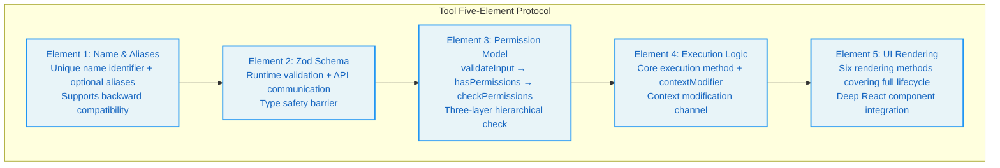
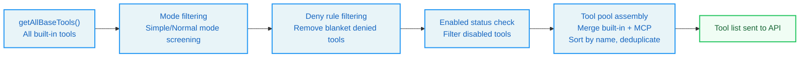
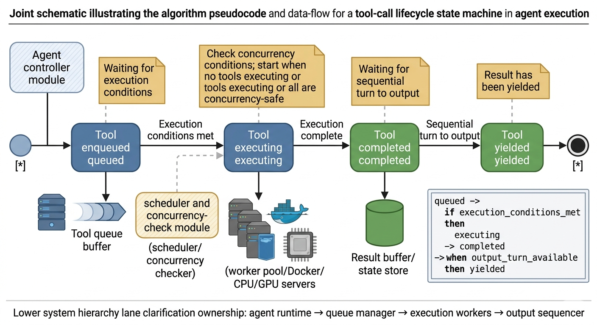

# Chapter 3: The Tool System -- The Agent's Hands

> "If all you have is a hammer, everything looks like a nail."
> -- Abraham Maslow

**Learning Objectives:** After reading this chapter, you will be able to:

- Master the design patterns of Claude Code's 45+ tools and understand the design philosophy of the five-element protocol
- Understand the complete architecture of the tool definition protocol, registration mechanism, and orchestration engine
- Analyze the scheduling principles and practical effects of concurrency partitioning strategies
- Understand the elegant design of the StreamingToolExecutor four-stage state machine
- Evaluate the engineering value of the deferred tool discovery mechanism

---

Maslow's quote could not be more fitting when applied to Agent tool systems. If an Agent only has a Bash tool, every task becomes a Shell command -- reading files with `cat`, searching code with `grep`, editing files with `sed`. This works, but it violates the engineering principle of "using the right tool for the right problem." Claude Code's tool system provides 45+ specialized tools, each optimized for a specific type of operation -- like equipping different professional tools for different tasks, rather than solving every problem with a single hammer.

## 3.1 The Tool Definition Protocol

Every tool in Claude Code follows a unified type contract -- `Tool<Input, Output, Progress>`. This contract is defined in the tool type core module and serves as the cornerstone of the entire tool system. Understanding it means understanding the anatomical structure of the Agent's "hands."

The design philosophy of this protocol can be summarized as "interface as architecture": by defining strict type interfaces, all architectural constraints of the tool system -- permission checks, concurrency control, progress reporting, UI rendering -- are enforced by the compiler. Developers cannot "forget" to implement a method, because the type checker will immediately raise an error.

### Core Types: Tool, Tools, ToolDef, buildTool

The `Tool` type is a generic interface that accepts three type parameters:

- `Input extends AnyObject`: The tool's input type defined using a Zod schema, ensuring each tool's input is a structured object.
- `Output`: The tool's output type, freely defined.
- `P extends ToolProgressData`: The tool's progress data type, used for streaming feedback.

The separation of the three generic parameters is a deliberate design decision. If input and output types were merged into one, the tool's signature would become harder to read; if the progress type were omitted, the tool would be unable to provide real-time feedback during execution. Separating the three gives each concern its own type space, and the compiler can check them independently.

The five elements that every tool must implement are as follows:



**Element 1: Name and Aliases**

Each tool has a unique name identifier, along with optional aliases for backward compatibility. When a tool is renamed, the old name can continue to match through an alias. The tool lookup function checks both the primary name and aliases.

The existence of the alias mechanism reveals an engineering practice principle: **in public APIs, renaming is an "add-only" operation.** Even when a tool's name is no longer accurate (e.g., renaming from `SearchTool` to `GrepTool`), the old name must remain available through an alias, otherwise configurations, scripts, and user habits that depend on the old name would all break.

**Element 2: Zod Schema**

Each tool uses Zod to define the schema for its input parameters. The Zod schema serves a dual purpose:

1. **Runtime validation**: Before tool execution, the parameters generated by the LLM are parsed through Zod, ensuring type and constraint correctness. This embodies the "don't trust external input" principle -- the LLM's output is uncontrollable, and tools must protect themselves.
2. **API communication**: The Zod schema is converted through a transformation layer into a JSON Schema that is sent to the API, letting the model know the meaning and constraints of each parameter. This means the schema definition is the tool's "user manual" -- the parameter descriptions the model sees come from the `describe()` calls in the Zod schema.

> **Cross-Reference:** Zod schema validation occurs in the first stage of the Chapter 4 permission pipeline (validateInput), which is a concrete manifestation of the "embedded security boundaries" design principle.

**Element 3: Permission Model**

The three permission-related methods form a layered permission check pipeline:

1. **Layer 1: Input validation (validateInput)**: Runs before permission checks, used to reject invalid inputs. This is a "data legitimacy" check, unrelated to permissions.
2. **Layer 2: Permission checks (hasPermissionsToUseTool + checkPermissions)**: Contains tool-specific permission logic. Different tools have different permission check granularity -- the Read tool may only check whether a path is in an allow list, while the Bash tool needs to parse commands and assess risk levels.
3. **Layer 3: Runtime property determination**: Affects the tool's concurrency scheduling strategy. For example, `isConcurrencySafe()` marks whether a tool can be executed in parallel.

The design philosophy behind the three-layer separation is "separation of concerns": data validation doesn't care about permission policies, permission policies don't care about concurrency scheduling. Each layer does one thing, but the three layers串联 together to provide complete protection.

**Element 4: Execution Logic**

This is the tool's core execution method. It receives parsed input parameters, the tool use context, a permission check function, a parent message reference, and an optional progress callback. The returned result carries output data and an optional context modifier.

The context modifier (contextModifier) allows a tool to modify the context after execution (e.g., updating the file cache), which is the key channel for tools to influence subsequent behavior. For example, FileWriteTool updates the file state cache through contextModifier after writing a file, so that subsequent FileReadTool invocations can see the latest file contents.

**Element 5: UI Rendering**

Tools have a rich set of rendering methods that cover the complete UI lifecycle:

- `renderToolUseMessage`: Displayed when a tool call starts (e.g., "Reading src/foo.ts")
- `renderToolUseProgressMessage`: Progress display during tool execution
- `renderToolResultMessage`: Tool result display
- `renderToolUseRejectedMessage`: Display when permission is denied
- `renderToolUseErrorMessage`: Display when execution encounters an error
- `renderGroupedToolUse`: Grouped display for multiple parallel tools

Each rendering method returns `React.ReactNode`, enabling deep integration between the tool system and the React rendering pipeline. This design choice means that a tool's UI presentation can be as flexible as React components -- progress bars, color highlighting, collapsible panels, table layouts can all be implemented through React components.

The coverage of these six rendering methods is noteworthy: it spans the entire "life cycle" of a tool call -- from start (renderToolUseMessage), to in-progress (renderToolUseProgressMessage), to success (renderToolResultMessage), rejected (renderToolUseRejectedMessage), error (renderToolUseErrorMessage), and grouped display for parallel execution (renderGroupedToolUse). This complete lifecycle coverage ensures that users always see clear, meaningful UI feedback regardless of the state.

### The buildTool Factory Function

`buildTool` is the standard factory function for creating tools. It accepts a partial tool definition and automatically fills in safe default values. These defaults follow the "fail-closed" principle: security-related methods (such as concurrency safety determination, read-only determination) default to false, and tools must explicitly declare themselves safe to enjoy optimizations like concurrency.

This design philosophy can be understood through an analogy: in airport security, the default assumption is that all luggage needs to be inspected (fail-closed), and only specially certified passengers (such as diplomats) can use the fast track. If it were the other way around -- defaulting to pass-through and only intercepting when problems are found (fail-open) -- then any missed check could cause a security incident.

The type system, through clever type computation, allows developers to provide only the necessary fields, while the factory function's return type guarantees a complete tool interface. If a developer provides a particular method in the definition, the type system uses the developer-provided signature; if omitted, the default signature is used. This "optional override, safe default" pattern is highly effective in engineering practice -- simple tools need only a few lines of code, while complex tools can be fully customized.

---

## 3.2 Tool Registration and Dynamic Discovery

### getAllBaseTools() -- The Complete Tool Inventory

`getAllBaseTools()` is the registration center for all built-in tools. It returns a flat array containing all available tools in Claude Code. Through this function, we can enumerate the core tool inventory and categorize them by function:

| Category | Tool | Responsibility | Concurrency Safe |
|----------|------|---------------|-----------------|
| Execution | BashTool | Run Shell commands | No (side effects) |
| File | FileReadTool, FileEditTool, FileWriteTool | Read, edit, write files | Read: yes, Edit/Write: no |
| Search | GlobTool, GrepTool | Filename pattern matching, content search | Yes |
| Notebook | NotebookEditTool | Jupyter Notebook editing | No |
| Web | WebFetchTool, WebSearchTool | Fetch URL content, web search | Yes |
| Agent | AgentTool | Sub-agent entry point | No |
| Task | TodoWriteTool, TaskCreateTool, etc. | Task management | Varies by tool |
| Planning | EnterPlanModeTool, ExitPlanModeV2Tool | Plan mode switching | No |
| Interaction | AskUserQuestionTool | Ask user questions | No (requires user response) |
| Skill | SkillTool | Invoke slash command skills | No |
| Configuration | ConfigTool | Modify configuration | No |
| MCP | ListMcpResourcesTool, ReadMcpResourceTool | MCP resource access | Yes |
| Worktree | EnterWorktreeTool, ExitWorktreeTool | Git worktree management | No |
| Notification | BriefTool | Message sending | No |
| Search Discovery | ToolSearchTool | Deferred tool discovery | Yes |

> **Design Insight:** Note the "Concurrency Safe" column -- more than half of the tools are marked as concurrency-unsafe. This reflects a profound engineering reality: in Agent systems, most operations have side effects (modifying files, executing commands, changing state), and operations that can truly be safely executed in parallel (pure reads, pure searches) are the minority. The core challenge of the concurrency partitioning algorithm (Section 3.4) is to maximize parallelism within this constraint.

### Dead Code Elimination in Tool Registration

Claude Code's tool registration makes extensive use of conditional imports to achieve compile-time dead code elimination. When specific conditions are not met, the entire module for the corresponding tool is not included in the final build. The same applies to tools controlled by feature flags.

Feature flags come from the build toolchain and are evaluated by the bundler at compile time. When a feature flag is off, the corresponding tool implementation code is removed by tree-shaking. This pattern ensures that external builds (for third-party users) do not contain internal tool code.

This design has significant security implications: if internal tools (such as REPL tools, debugging tools) were included in external builds, even if they were unavailable, they could leak internal architecture information. Dead code elimination eliminates this information leakage risk at the source.

In the tool registration function, conditional registration uses the spread operator, deciding whether to include specific tools based on the runtime environment and feature flags.

### ToolSearchTool Deferred Discovery Mechanism

When the number of tools exceeds a certain threshold, Claude Code enables deferred tool discovery. The core idea is: instead of sending the complete schema of all tools in the initial system prompt, send only the tool name list and let the model load detailed schemas on demand through ToolSearchTool.

To understand this with an analogy: the traditional approach is like placing the entire encyclopedia in front of the model -- even though most of the content won't be used in the current conversation. Deferred discovery is like giving the model a table of contents index -- the model knows which tools are available and only opens the corresponding page to view detailed parameters when needed.

ToolSearchTool's implementation follows the standard factory function pattern. The logic for determining whether a tool should be deferred is: tools explicitly marked as always-loaded are not deferred, MCP tools are always deferred, and the tool search tool itself is not deferred.

The core value of this mechanism is saving prompt space: when MCP servers register dozens of tools, sending all of them to the API consumes a large number of tokens. Deferred discovery allows the model to load complete tool schemas only when needed, significantly reducing the initial prompt size.

> **Best Practice:** If you are building your own Agent system and connecting external tools through the MCP protocol, pay attention to the token consumption of tool schemas. Each tool's schema includes its name, description, and parameter definitions, which can consume thousands of tokens when the number of tools reaches 50+. Deferred discovery is an effective optimization strategy.

### Tool Filtering Pipeline

From `getAllBaseTools()` to the final list of tools sent to the API, multiple layers of filtering are applied:



1. **Mode filtering**: Filters tools based on the mode. Simple mode only retains Bash, Read, and Edit; normal mode excludes special tools. This modularized tool filtering ensures that in constrained environments, the Agent can only use the most basic tool set.
2. **Deny rule filtering**: Removes tools matched by blanket deny rules.
3. **Enabled status check**: Filters out disabled tools.
4. **Tool pool assembly**: Merges built-in tools with MCP tools, sorts by name and deduplicates. The purpose of sorting is to ensure prompt cache stability -- changes in tool order would cause cache invalidation.

> **Cross-Reference:** Mode filtering and deny rule filtering are closely related to the permission pipeline in Chapter 4. Tool filtering is the first line of defense in the permission system (tool visibility filtering), ensuring that the model cannot even "see" tools it should not use.

---

## 3.3 Deep Dive into Core Tools

### BashTool: The Swiss Army Knife of Command Execution

BashTool is one of Claude Code's most powerful tools, and also the most complex. It is not merely a simple Shell executor, but an execution environment with multiple layers of security protection. If the tool system is the Agent's hands, BashTool is the most powerful among them -- and the one that most needs to be constrained.

BashTool's special status in the tool system is reflected in the following aspects:

- **Error propagation**: When BashTool execution fails, all parallel Bash tool calls are canceled. This is because Bash commands often have implicit dependency chains (e.g., after `mkdir` fails, subsequent commands are meaningless). This design embodies the "fail fast" principle -- rather than letting subsequent commands continue executing in a corrupted environment and producing more errors, it is better to immediately stop the entire batch.

- **Interruption behavior**: BashTool can customize its behavior when the user interrupts. Some long-running commands (such as test suites) may choose to block rather than cancel. This design reflects a nuanced understanding of user intent: interrupting a running `npm install` should stop immediately (the user changed their mind), but interrupting a test suite might just mean the user wants to see current progress (the results are still valuable once tests complete).

- **Semantic analysis**: BashTool performs AST parsing and semantic analysis on commands, determining whether a command is a search/read operation (`isSearchOrReadCommand`), used for UI collapsible display. This embodies the "intelligent tool" design philosophy -- tools are not just passive pipelines for executing commands, but can understand command semantics and make corresponding UI decisions.

- **Sandbox integration**: Through the `--dangerouslyDisableSandbox` parameter and sandbox configuration, it controls the security boundary of command execution. The sandbox is BashTool's "safety net" -- even in bypass permission mode, the sandbox can still restrict a command's filesystem access scope.

### The File Trio: FileReadTool, FileEditTool, FileWriteTool

These three tools constitute Claude Code's complete file operation capability set. Their division of labor reflects the classic CRUD pattern of database operations (Create/Read/Update), except for the absence of Delete -- this is a deliberate safety decision, because "deleting files" is an irreversible operation that is typically accomplished through BashTool's `rm` command, which triggers stricter permission checks.

**FileReadTool** is responsible for reading file contents. It maintains a file state cache for tracking which files have been read, avoiding duplicate memory attachment injection. This caching mechanism is key to performance optimization -- if the same file is read multiple times (in different tool call rounds), the cache ensures that actual file I/O is only triggered on the first read, and subsequent reads use cached results directly.

**FileEditTool** is responsible for precise file editing. It uses an `old_string -> new_string` exact replacement pattern rather than line number ranges, ensuring that edit operations remain correct even when the file changes. This choice deserves deeper analysis:

- **Why not line numbers?** Line numbers are fragile -- if another tool (or the user) modifies the file between reading and editing, the line numbers may have shifted, causing edits to be applied to the wrong location.
- **Why exact string matching?** String matching is idempotent -- as long as the target string exists in the file, the edit can be correctly located. Even if the file has been partially modified, as long as the target fragment hasn't been touched, the edit is safe.

FileEditTool's `isDestructive` method determines whether an edit is a destructive operation based on the edit content (e.g., deleting a large amount of code). This context-aware destructiveness determination is more precise than a simple "write equals destructive" label.

**FileWriteTool** is responsible for creating or completely overwriting files. This is the "heaviest" file operation with the strictest permission checks. The difference between FileWriteTool and FileEditTool lies in scope -- Edit only modifies specific fragments within a file, while Write can completely overwrite file contents. Therefore, Write has higher permission check standards.

All three tools support `contextModifier`, which updates the file state cache after execution, enabling subsequent tool calls and memory attachment injection to see the latest file state.

> **Best Practice:** When designing your own Agent tools, follow the "least privilege" principle -- prefer Edit over Write, prefer Read over Bash. This is not only a security concern but also an efficiency issue: a precise Edit is faster than writing an entire file and less error-prone.

### The Search Duo: GlobTool and GrepTool

**GlobTool** uses filename pattern matching to find files, powered by the `fast-glob` library under the hood. It returns a list of matching file paths, supporting ignore patterns and maximum result count limits.

**GrepTool** uses regular expressions to search file contents, powered by `ripgrep` under the hood. It supports multiple output modes (filenames, content lines, counts) and rich filtering options (file types, glob patterns, etc.).

The design of these two tools embodies the principle of "specialization over generalization." Although BashTool can achieve similar functionality through `find` and `grep` commands, dedicated search tools have several advantages:

1. **Structured output**: Search tools return structured result lists rather than the text output of Shell commands. The model can parse structured data more accurately.
2. **Permission control**: Search tools are read-only by default, with more lenient permission checks. If every search had to go through BashTool, users would face more permission confirmation prompts.
3. **Performance optimization**: Dedicated search tools can be optimized for specific scenarios (e.g., limiting result counts, parallel searching), while Shell commands have limited optimization room.

It is worth noting that when Ant native builds embed dedicated fast search tools, GlobTool and GrepTool are disabled because the `find` and `grep` commands in the Shell have been aliased to these fast tools, and BashTool can use them directly.

### AgentTool: The Sub-Agent Entry Point

AgentTool is the core tool for Claude Code's multi-agent collaboration. It allows the primary agent to spawn sub-agents to handle subtasks. Sub-agents have their own independent context windows and tool sets, and return results to the primary agent upon completion.

AgentTool has several special properties within the tool system:
- It may be marked as `alwaysLoad`, ensuring it remains visible in the first round even when ToolSearch is enabled. This is because sub-agents are a critical capability for handling complex tasks and should not be hidden by the deferred discovery mechanism.
- Sub-agents are created through `createSubagentContext` with independent `ToolUseContext` instances, inheriting some state from the parent context (such as permission rules) but having independent message lists. This "inherit but don't share" pattern ensures that sub-agents don't accidentally modify the parent agent's state.
- Sub-agent results are exposed to the primary agent through `TaskOutputTool`.

> **Cross-Reference:** The complete architectural design of sub-agents will be analyzed in depth in Part 3, Extensions, including context isolation strategies, permission bubbling mechanisms, and result passing protocols.

---

## 3.4 The Tool Orchestration Engine

The tool orchestration engine is the "command center" of the tool system -- it determines how multiple tool calls are scheduled, executed, and their results collected. A good orchestration engine must balance three objectives: **parallelism** (execute in parallel as much as possible to improve speed), **safety** (avoid data races caused by concurrent execution), and **ordering** (ensure that results are produced in the same order as requests).

### The runTools() Function and Concurrency Partitioning

The core logic of tool orchestration resides in the tool orchestration module. The `runTools` function is an async generator responsible for scheduling the execution of a batch of tool calls.

Its scheduling strategy is based on **concurrency partitioning**:

1. First, all tool calls are sequentially divided into batches.
2. Each batch is either a group of consecutive concurrency-safe tools, or a single unsafe tool.
3. Concurrency-safe batches are executed in parallel.
4. Unsafe batches are executed serially.

The core logic of the partitioning algorithm: iterate through all tool calls, checking each tool's concurrency safety property. If the current tool is safe and the previous batch is also safe, merge into the same batch; otherwise, start a new batch.

This algorithm can be compared to an assembly line: imagine a factory with multiple workstations. Some processes are independent (like simultaneously inspecting the quality of multiple parts) and can proceed in parallel; other processes must strictly follow sequence (like assembly before testing) and cannot be skipped. The concurrency partitioning algorithm is the scheduler that automatically identifies which processes can be parallelized and which must be serialized.

For example, if the model requests four tool calls: `[Read(a.ts), Read(b.ts), Bash(ls), Read(c.ts)]`, the partitioning result is:


The concurrency limit for parallel execution is controlled by an environment variable, defaulting to 10.

> **Design Insight:** Why can't Read(c.ts) be placed in the same batch as Bash(ls)? Because Bash commands may have side effects -- they might create new files, modify file contents, or change directory structures. If files are read while Bash is executing, Read might get either the old data from before execution or the new data from after execution, leading to unpredictable behavior. Serial execution ensures that Read(c.ts) sees the deterministic state after Bash(ls) has completed.

### StreamingToolExecutor Streaming Execution

`StreamingToolExecutor` is an enhanced version of `runTools` that does not wait for the model's response to fully complete before starting tool execution -- instead, it immediately initiates execution as tool call blocks are received in the stream.

The impact of this design is significant. Suppose the model requests five tool calls in one response, and each tool takes 1 second to execute. In the traditional mode, the model takes 2 seconds to generate the complete response (streaming output time), then batch tool execution takes 5 seconds, for a total of 7 seconds. In streaming execution mode, the first tool starts executing about 0.4 seconds after the model begins outputting (the time to generate the first tool_use block), and subsequent tools start one after another, for a total of about 3 seconds -- a speed improvement of over 50%.

Each tracked tool has a four-stage state machine:



- **queued**: The tool has been enqueued, waiting for execution conditions to be met.
- **executing**: Currently executing. Before execution, concurrency conditions are checked: execution is allowed to start only when no tools are executing, or all executing tools are concurrency-safe.
- **completed**: Execution is complete and results have been collected. But not yet yielded to the upper layer (order must be maintained).
- **yielded**: The result has been yielded, and the tool's lifecycle ends.

Key design decisions of StreamingToolExecutor:

1. **Order guarantee**: Even though tools can complete in parallel during streaming execution, the yielding of results still maintains the same order as the requests. The result collection function, when traversing the tool list, stops when it encounters an incomplete non-safe tool, ensuring the ordering constraint is not violated. This is a delicate balance between parallelism and consistency -- allowing parallel execution for speed, while guaranteeing ordered result presentation to simplify upper-layer processing logic.

2. **Error propagation**: BashTool execution failure cancels all parallel sibling tools. Non-Bash tool errors do not propagate -- because read/search operations are typically independent. This distinction is important: Bash command failures usually mean something is wrong with the environment (e.g., disk full, network down), and continuing to execute other commands at that point will likely also fail. File read or search operation failures are typically localized (e.g., file doesn't exist, pattern doesn't match) and don't affect other operations.

3. **Immediate progress yielding**: Progress messages during tool execution bypass the ordering constraint and are immediately yielded to the upper layer. This allows the UI to display tool execution progress in real-time without waiting for preceding tools to complete. This design reflects the priority of user experience -- progress messages are "informational" and don't need strict ordering guarantees; result messages are "factual" and must maintain order.

4. **Discard mechanism**: When a streaming fallback occurs (the model switches to a fallback model), all pending and executing tools are marked as discarded, preventing stale results from leaking. This is equivalent to an "emergency brake" -- when the model decides to change strategy, all tool call results based on the old strategy should be discarded.

5. **Signal propagation**: Each tool execution uses an independent sub-cancellation controller, forming a hierarchical cancellation signal chain. Errors from sibling tools or the user's Ctrl+C propagate to the correct tools through signal propagation. This hierarchical signal propagation ensures precision of cancellation operations -- canceling one tool won't accidentally affect unrelated other tools.

> **Anti-Pattern Warning:** If you are building your own tool orchestration system, avoid using a single AbortController to manage all tool cancellations. When tool A fails and needs to cancel tool B, it should not simultaneously cancel the completely unrelated tool C. Hierarchical cancellation signals are the correct design.

### Tool State Machine Integration in the Dialog Main Loop

Returning to the dialog main loop, tool execution state is tightly integrated with the dialog loop state:

1. **Streaming execution path**: When the streaming tool execution feature is enabled, a StreamingToolExecutor is created. While receiving tool call blocks in the stream, tools are immediately added to the execution queue, and the system checks whether any completed results can be immediately yielded. This implements a "receive-while-executing" pipeline pattern.

2. **Batch execution path**: When streaming execution is unavailable, the traditional batch execution function is used to execute all tools after the model's response has fully completed. This is the fallback for streaming execution, ensuring the system can still work normally when streaming functionality is disabled or encounters errors.

3. **Context propagation**: After tool execution, the context may be modified (e.g., file cache updates). These modifications propagate back to the dialog loop, affecting the execution environment of subsequent tools. Context propagation is key to "consistency" -- if tool A writes to a file but the cache isn't updated, subsequent tool B might make incorrect decisions based on stale cache data.

> **Cross-Reference:** The streaming execution path is tightly integrated with phases 3 and 4 of the dialog main loop from Chapter 2. Understanding streaming execution requires grasping it within the context of the overall dialog main loop flowchart.

---

## Practical Exercises

**Exercise 1: Implement a Custom Tool**

Use the `buildTool` factory function to create a simple tool. Requirements:
- Define a Zod schema containing a `path` field (string type)
- Implement the `call` method that returns file information for the specified path
- Correctly mark `isReadOnly` and `isConcurrencySafe`
- Implement `renderToolUseMessage` and `renderToolResultMessage`

Compare your implementation with FileReadTool to understand the role of `buildTool` default values.

**Discussion Question:** Should your custom tool's `isConcurrencySafe` be marked as true or false? If marked incorrectly (a read-only tool marked as false, or a write tool marked as true), what problems would each case cause?

**Exercise 2: Analyze Concurrency Partitioning Strategy**

Given the following tool call sequence:
```
[GlobTool(*.ts), GrepTool(pattern), BashTool(npm test), FileReadTool(a.ts), FileEditTool(a.ts), GlobTool(*.json)]
```

Manually execute the logic of `partitionToolCalls`, and draw the batch partitioning result. Then consider: why can't FileEditTool and GlobTool be placed in the same concurrent batch?

**Detailed Analysis:** Draw the safety marking for each tool, then step through the partitioning algorithm's decision process. The final answer should be:

```
Batch 1 (Concurrency Safe): [GlobTool(*.ts), GrepTool(pattern)]   -- Parallel execution
Batch 2 (Not Safe):         [BashTool(npm test)]                   -- Serial execution
Batch 3 (Not Safe):         [FileReadTool(a.ts)]                   -- Serial execution (affected by Batch 2, cannot merge into Batch 1)
Batch 4 (Not Safe):         [FileEditTool(a.ts)]                   -- Serial execution
Batch 5 (Concurrency Safe): [GlobTool(*.json)]                     -- Can be parallel (but only one tool)
```

**Exercise 3: Trace the StreamingToolExecutor Lifecycle**

Set breakpoints at the tool enqueue, tool execution, and result retrieval stages of the StreamingToolExecutor. Send a request that triggers multiple parallel tool calls (e.g., "search for all TODO comments and read the related files"), and observe how tool states transition from queued to executing to completed to yielded, and how progress messages are yielded immediately.

**Extended Observation:** During tool execution, press Ctrl+C and observe how the cancellation signal propagates from the user to each tool. Note how the hierarchical cancellation controllers ensure that only the currently executing tools are canceled, while the results of already completed tools are unaffected.

**Exercise 4: Evaluate the Performance Impact of Deferred Discovery**

If your environment has an MCP server connected, observe the difference in API call token consumption under the following two conditions:
- Deferred discovery disabled (all tool schemas in the initial prompt)
- Deferred discovery enabled (only tool name list in the initial prompt)

Record the input token count difference in both cases, and calculate how many tokens deferred discovery saves you.

---

## Key Takeaways

1. **The five-element protocol is the DNA of the tool system**: name, schema, permissions, execution, and rendering. Each tool defines itself along these five dimensions, and `buildTool`'s default value mechanism lets simple tools focus only on core logic. The design philosophy of this protocol is "explicit declaration, safe defaults" -- tools must proactively declare themselves safe; otherwise, they default to unsafe.

2. **Dead code elimination ensures build security**: Through conditional imports based on environment variables and feature flags, internal tools are prevented from leaking into external builds. This is an important engineering practice for Agent systems in multi-tenant environments. Combined with the "progressive capability extension" principle from Chapter 1, dead code elimination ensures that different product forms can share the same codebase.

3. **Concurrency partitioning is key to performance**: The `isConcurrencySafe` determination decides whether tools can execute in parallel. Correctly marking read-only tools as concurrency-safe allows the Agent to simultaneously execute multiple search/read operations in a single turn, dramatically reducing response time. But the cost of incorrect marking is data races and unpredictable behavior -- this is a design decision that requires careful consideration.

4. **StreamingToolExecutor is a zero-wait tool scheduler**: It starts executing tools while the model is still generating tool_use blocks, and through a four-stage state machine and ordering guarantees, it strikes a balance between parallelism and consistency. It is the perfect embodiment of the "async streaming first" design principle at the tool system level.

5. **Tool system extensibility comes from the type contract**: The generic design of `Tool<Input, Output, Progress>` gives each tool its own type space, while `ToolUseContext` provides a unified execution environment. Adding new tools requires no modifications to the orchestration engine's code -- this is exactly the realization of the "progressive capability extension" principle mentioned in Chapter 1 at the tool level.

In the next chapter, we will dive into the Agent's safety guardrails -- the permission pipeline. If the tool system gives the Agent the ability to act, the permission pipeline defines the boundaries of the Agent's actions. Understanding the design of the permission pipeline, you will know how Claude Code finds the precise balance between "autonomous execution" and "safety assurance."
