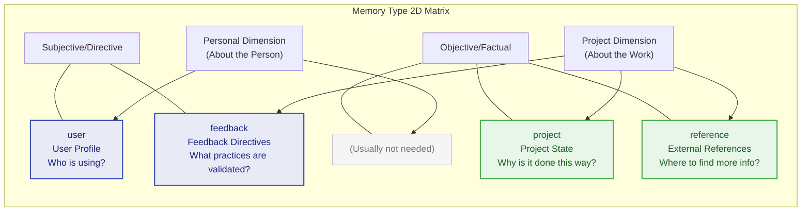
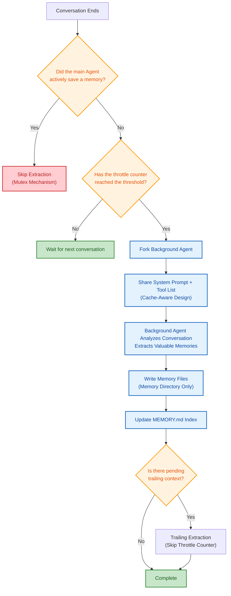
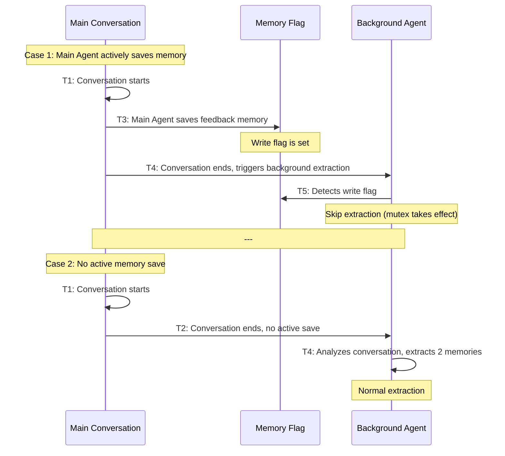
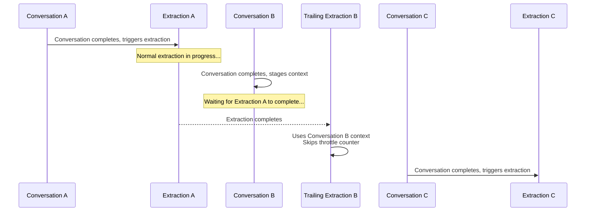
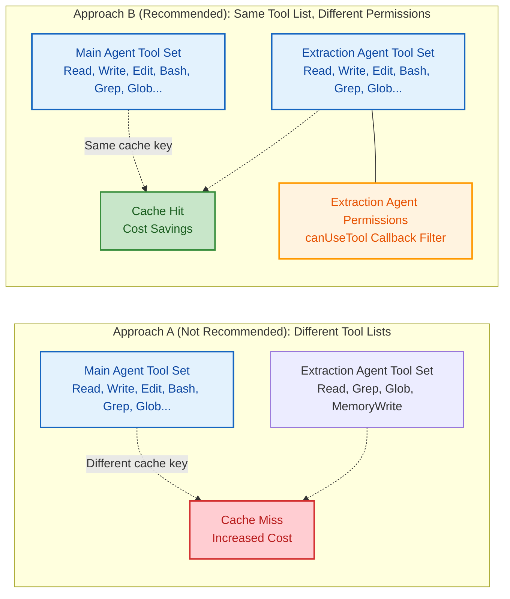
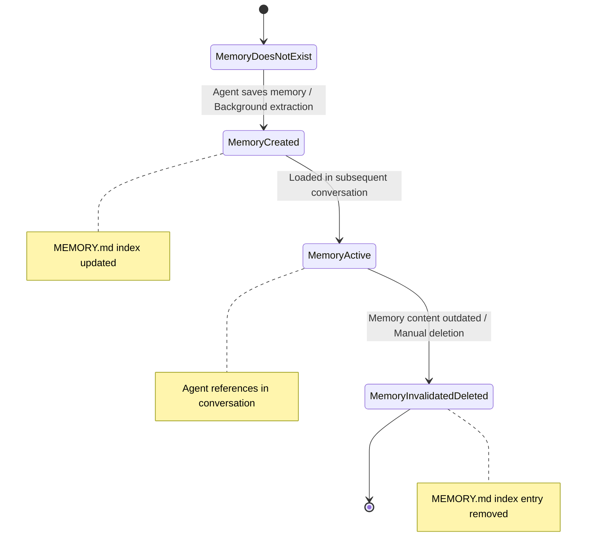
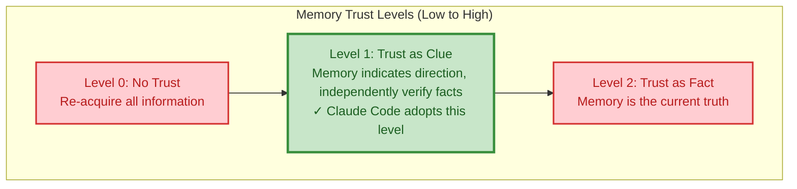

# Chapter 6: The Memory System -- Agent Long-Term Memory

> **Learning Objectives:** Master the design intent and automatic extraction mechanism of four memory types, understand the cache-aware architecture based on the Fork pattern, and learn how to design a persistent Agent memory system. Through this chapter, you will understand how to leverage the memory system to make the Agent increasingly understand you with use, and how to manage the lifecycle of memories in a multi-project environment.

---

Humans can maintain coherence across multiple conversations because we have memory. Similarly, a truly useful Agent cannot start from scratch every conversation -- it needs to remember who the user is, what the project is doing, and which practices have been validated. Claude Code's memory system (memdir) was built for exactly this purpose: a file-based, typed, cross-session persistent memory architecture.

Comparing the memory system to "long-term memory" is a biologically precise analogy. Human memory is divided into sensory memory (milliseconds), working memory (seconds, corresponding to the context management in Chapter 7), and long-term memory (minutes to years, corresponding to the memory system in this chapter). Claude Code's design follows this same layering: the context window is "working memory," temporarily holding information within a single session; while memdir is "long-term memory," persistently storing non-derivable critical knowledge across sessions.

## 6.1 Taxonomy of the Four Memory Types

### 6.1.1 Closed Type System

Claude Code's memory is constrained to a closed four-type classification system, defined in memory type constants: user, feedback, project, and reference.

The design philosophy of these four types is: **only save information that cannot be derived from the current project state.** Code patterns, architecture, file structure, and Git history can all be obtained in real time through tools (grep, git log), and therefore do not fall within the scope of memory.

**Why must it be a closed system?**

An open type system (allowing arbitrary custom types) appears more flexible but has fatal flaws in the Agent scenario: (1) Type explosion -- different users and projects might create dozens of types, making it impossible for the Agent to efficiently determine which memories are relevant to the current conversation when reading; (2) Classification ambiguity -- the same piece of information might belong to multiple custom types, leading to duplicate storage; (3) Index bloat -- the MEMORY.md index would need to maintain classification logic for each type, adding unnecessary complexity.

The closed four-type design embodies a "constraint is freedom" philosophy: constraining the classification method yields efficient consistent reasoning and precise relevance judgment.

### 6.1.2 Detailed Analysis of the Four Types

The relationship between the four memory types can be understood through a two-dimensional matrix:



> **user** -- User Profile

Stores the user's role, goals, and knowledge background. Helps the Agent adjust its collaboration style for users of different expertise levels -- it should communicate differently with a senior engineer versus a beginner.

```
when_to_save: When learning about the user's role, preferences, or knowledge background
how_to_use:  When needing to adjust explanation depth and collaboration style based on the user profile
```

Example: When a user says "I've been writing Go for ten years, but this is my first time touching React," the Agent saves a user-type memory and uses backend analogies when explaining frontend concepts in the future.

**Practical Application Scenarios:**

Scenario 1: Cross-project user preferences. After a user expresses preferences in project A, the Agent can apply the same preferences in project B. Because user-type memories are stored in the user's global directory, they naturally support cross-project sharing.

Scenario 2: Progressive understanding of the user. In the first conversation, the user mentions being a data scientist, and the Agent records this as a user memory. In the fifth conversation, the user demonstrates advanced Python skills, and the Agent updates the memory to add "proficient in Python, familiar with pandas/numpy." This progressive user profile building enhances the Agent's collaboration capabilities over time.

**feedback -- Feedback Directives**

Records the user's corrections and confirmations regarding Agent behavior. This is one of the most important memory types -- it enables the Agent to maintain behavioral consistency across future conversations.

```
when_to_save: When the user corrects your approach ("don't do that") or confirms a non-obvious successful practice
body_structure: The rule itself + Why: reason + How to apply: applicable scenarios
```

Key design: It records not only failures (corrections) but also successes (confirmations). If only corrections are saved, the Agent becomes overly cautious, deviating from validated methods.

**Practical Application Scenarios:**

Scenario 1: Code style preferences. The user says "don't use var, use const and let for everything," and the Agent saves this as a feedback memory. In all subsequent conversations, the Agent's generated code defaults to using const/let.

Scenario 2: Process requirements. The user says "lint must be run before committing code," and the Agent saves this as a feedback memory. Before every subsequent git commit execution, the Agent automatically runs the lint command.

Scenario 3: Lessons from failure. The user says "last time you directly modified package.json which caused version conflicts; from now on, check with me before changing dependencies," and the Agent saves this as a feedback memory, proactively requesting confirmation when modifying dependency files in the future.

**project -- Project State**

Records the non-code state of a project -- decisions, deadlines, work in progress. Code and Git history are derivable, but information like "why it was done this way" and "when it needs to be completed" is not.

```
when_to_save: When learning about who is doing what, why, and when it will be completed
body_structure: Fact or decision + Why: motivation + How to apply: impact on recommendations
```

Special attention: Relative dates must be converted to absolute dates ("Thursday" -> "2026-03-05"), because memories persist across sessions, and relative dates lose their meaning in future conversations.

**Practical Application Scenarios:**

Scenario 1: Architecture Decision Records (ADR). The user says "the authentication module uses JWT instead of Session because it needs to support mobile clients," and the Agent saves this as a project memory. When authentication-related code needs modification in the future, the Agent can understand the background of this decision.

Scenario 2: Work in progress. The user says "I'm migrating the user module from REST to GraphQL; I've completed the query part and need to work on the mutation part next," and the Agent saves this as a project memory. In the next conversation, the Agent can continue working from the correct context.

Scenario 3: Team conventions. The user says "our team agreed that all API responses use camelCase, but database fields use snake_case," and the Agent saves this as a project memory, following this convention when generating code.

**reference -- External References**

Pointers to external systems -- Linear projects, Grafana dashboards, Slack channels. This information is not in the code repository but is critical for understanding project context.

```
when_to_save: When learning about external system resources and their purposes
how_to_use:  When the user references external systems or needs to look up external information
```

**Practical Application Scenarios:**

Scenario 1: Monitoring dashboards. The user says: "the production Grafana dashboard is at [https://grafana.company.com/d/abc123](https://grafana.company.com/d/abc123)." The Agent saves this as a reference memory. When the user asks, "any anomalies recently," the Agent can remind the user to check this dashboard.

Scenario 2: Documentation links. The user says: "the API docs are on Confluence at [https://confluence.company.com/pages/api-docs](https://confluence.company.com/pages/api-docs)." The Agent saves this as a reference memory.

Scenario 3: Communication channels. The user says "backend team discussions are in the #backend-dev Slack channel," and the Agent saves this as a reference memory, reminding the user when cross-team coordination is needed.

### 6.1.3 Explicitly Excluded Information

The memory type validation module explicitly lists content that should not be saved as memory:

- Code patterns, conventions, architecture, file paths -- derivable by reading code
- Git history -- `git log` / `git blame` are authoritative sources
- Debugging solutions -- the fix is already in the code, the context is in the commit message
- Documentation already in CLAUDE.md
- Temporary task details -- transient state of the current conversation

Even when a user **explicitly requests** saving such information, the system guides toward a more valuable direction: "If you want to save a list of PRs, tell me what's **surprising** or **non-obvious** about them -- that's what's worth saving."

**The Deeper Logic of This Exclusion Principle**

Many users, when first using the memory system, try to have the Agent memorize "the project's file structure" or "the API route list." This instinct is understandable -- humans确实 need to understand this information when taking over a new project. But there is a key difference between Agents and humans: Agents can read the file system in real time during every conversation.

```
Information Acquisition Cost Comparison:

Human Developer:
  Memorize file structure -> hours of reading and understanding
  Recall when needed next time -> seconds (if remembered)
  -> Value of memory = time saved from re-reading

Agent:
  Read file structure in real time -> milliseconds for a tool call
  Cost of re-acquiring each time -> a few hundred tokens
  -> Value of memory ≈ 0 (because real-time acquisition cost is minimal)
```

Therefore, the memory system should focus on saving information that "cannot be acquired in real time" -- people's preferences, the rationale behind decisions, external links. The common characteristic of this information is that it exists in people's minds or external systems and cannot be obtained by reading the code repository.

### 6.1.4 Best Practices for Memory Usage

**Memories That Should Be Saved (Positive Examples):**

| Scenario | Memory Type | Content to Save |
|----------|-------------|-----------------|
| User expresses preference | feedback | "User prefers Vitest over Jest" + Why: faster test execution |
| User corrects behavior | feedback | "Don't modify files in the generated folder" + Why: they are auto-generated by protoc |
| Architecture decision | project | "Use event-driven architecture instead of direct calls" + Why: need for service decoupling |
| External system link | reference | "Monitoring alerts are in PagerDuty's X service" |
| User background | user | "User is a full-stack developer, proficient in TypeScript and Python" |

**Memories That Should NOT Be Saved (Negative Examples):**

| Scenario | Why Not to Save | Correct Approach |
|----------|----------------|------------------|
| Project file listing | Can be obtained in real time via `ls` | No memory needed |
| API endpoint list | Can be obtained by reading route code | If there are non-obvious design decisions, save only the decisions |
| Bug fix steps | Already recorded in commit messages | If the fix involves counter-intuitive reasons, save the "why" |
| Third-party library versions | Can be obtained by reading package.json | If there are special reasons for the selection, save the reasons |

### 6.1.5 Common Misconceptions in Memory Management

**Misconception 1: More Memories Is Better**

This is the most common misconception. Some users have the Agent memorize every detail from conversations, leading to MEMORY.md index bloat and a large accumulation of low-value files in the memory directory. Too many memories not only increase the context burden for each conversation but may also cause the Agent to be distracted by "noise" and overlook truly important memories.

**Correct approach:** Regularly review the memory directory and delete outdated or low-value memories. A good memory should pass the test of "if this memory were deleted, would the Agent's behavior be substantively different?"

**Misconception 2: Treating Memory as a Documentation System**

Some users try to use the memory system as a replacement for project documentation, having the Agent memorize all technical specifications and design documents. This violates the principle of "only save non-derivable information" -- technical specifications should be placed in the code repository's documentation directory, not in the memory system.

**Correct approach:** Place technical documentation in the `docs/` directory, and the "why" behind architectural decisions in memory.

**Misconception 3: Ignoring the Relative Date Problem**

The user says "this feature launches next Tuesday," and the Agent saves "launches next Tuesday." But two days later in the next conversation, "next Tuesday" has become "this Tuesday," and a week later it becomes "last Tuesday." This memory is not only useless but potentially misleading.

**Correct approach:** All time-related memories must use absolute dates. The Agent should convert "next Tuesday" to a specific date (e.g., 2026-04-07) before saving.

> **Cross-Reference:** The exclusion principle for memories shares the same philosophy as the compression strategy in Chapter 7 (Context Management) -- only retain information that cannot be re-acquired. Context compression clears old tool results (which can be re-acquired by re-executing tools), and the memory system excludes code patterns (which can be re-acquired by re-reading code).

## 6.2 Memory File Format

### 6.2.1 Frontmatter Format

Each memory is an independent Markdown file that uses YAML Frontmatter to declare metadata. The format requires three fields: name (memory name), description (a one-line description used to determine relevance in future conversations), and type (one of the four types). The `type` field must be one of the four types (strictly validated); legacy files without a type field can continue to work but cannot be filtered by type.

**Why use Markdown files instead of a database?**

This is an architectural choice worth analyzing. Using a file system instead of a database has the following advantages:

1. **Readability**: Developers can directly view and edit memory files with a text editor
2. **Version control**: Memory files naturally support Git tracking (if placed in a project directory)
3. **Portability**: The file system is the lowest common denominator, requiring no additional dependencies
4. **Debuggability**: When problems occur, simply `ls` and `cat` to diagnose
5. **Cost**: No need to maintain database connections, indexes, or backups

The downside is limited query capability -- complex relational queries or full-text searches are not possible. However, for the Agent's memory scenario, the query pattern is a simple "load all relevant memories" rather than complex relational queries, and the file system's capabilities are sufficient.

### 6.2.2 MEMORY.md Index File

`MEMORY.md` is the entry point of the memory system -- it is not a memory itself but an index file. At the start of each conversation, it is automatically loaded into the context, allowing the Agent to quickly understand the overview of existing memories.

The memory directory module's constants define the index capacity limits: the index file is named `MEMORY.md`, with a maximum of 200 lines and 25KB.

The format for index entries requires one line per entry, no more than 150 characters:

```markdown
- [Title](file.md) -- One-line hook description
```

The `truncateEntrypointContent` function implements dual capacity protection: first truncation by lines (200-line limit), then truncation by bytes (25KB limit). When limits are exceeded, a warning is appended to the end of the file indicating which limit was triggered.

**The Design Wisdom of Dual Capacity Protection**

Why are two layers of limits needed? The line limit and byte limit each address different concerns:

- **Line limit (200 lines)**: Protects the Agent's comprehension efficiency. Even if each line is short, an index of more than 200 lines requires the Agent to spend more tokens understanding and filtering. The line limit ensures that the index always remains a "quick browse" tool rather than a "deep reading" document.
- **Byte limit (25KB)**: Protects the context budget. A single memory's index entry may contain a long description (approaching the 150-character limit), and 200 such entries could reach 30KB, putting pressure on the context window. The byte limit provides a hard cost ceiling.

The order of the two layers also matters -- truncation by lines first, then by bytes. This means: when there are fewer memory entries but longer descriptions, the byte limit triggers first; when there are more memory entries but shorter descriptions, the line limit triggers first. In either case, there is a corresponding protection mechanism.

### 6.2.3 Directory Structure of Memory Files

The storage path for memory files is determined by functions in the path resolution module. The default path is:

```
~/.claude/projects/<sanitized-git-root>/memory/
```

Path resolution priority:

1. `CLAUDE_COWORK_MEMORY_PATH_OVERRIDE` environment variable (full path override for Cowork mode)
2. `autoMemoryDirectory` setting (only policySettings/localSettings/userSettings, **projectSettings is excluded**)
3. Default `<memoryBase>/projects/<sanitized-git-root>/memory/`

projectSettings is once again excluded for the same reason as in the previous chapter -- preventing a malicious repository from redirecting writes to sensitive directories via `autoMemoryDirectory: "~/.ssh"`. The path validation function performs strict security checks on this: rejecting relative paths, root paths, Windows drive letter roots, UNC paths, and null byte injection.

**Complete Defense Lines of Path Security Validation**

The path validation function's rejection list reveals the various path manipulation techniques an attacker might attempt:

| Attack Technique | Example | Defense Method |
|-----------------|---------|---------------|
| Relative path | `../../etc/passwd` | Reject non-absolute paths |
| Root path | `/` | Reject root paths |
| Windows drive letter root | `C:\` | Reject drive letter root paths |
| UNC path | `\\server\share` | Reject UNC paths |
| Null byte injection | `foo\0.txt` | Reject paths containing null bytes |
| Outside user directory | `/tmp/mem` | Reject paths not under allowed base directories |

These checks stack on top of each other to form a defense-in-depth system. Even if one check is bypassed, the next check can still block the attack.

> **Cross-Reference:** The projectSettings exclusion mechanism is consistent with the security boundary design in Chapter 5 (Settings and Configuration). Memory path validation is a specific application scenario of the configuration system's security policy.

## 6.3 Automatic Memory Extraction

### 6.3.1 Background Extraction Based on the Fork Pattern

The core of the memory extraction system resides in the memory extraction module. It is not executed directly by the main conversation but runs in the background through `runForkedAgent` -- a "perfect fork" pattern.

The so-called "perfect fork" means the background Agent shares the exact same system prompt and tool set as the main conversation. This means:

- The background Agent has the same context understanding capabilities as the main Agent
- The background Agent uses the same tool set but with stricter permission restrictions
- **Prompt cache is shared between the main conversation and the background Agent**

The extraction is triggered at the end of each complete query loop (triggered when the model produces a final response with no tool calls).



**Why not extract memory directly in the main conversation?**

This design choice involves trade-offs across multiple dimensions:

```
Direct extraction in main conversation:
  Pros -> Simple implementation, no inter-process communication overhead
  Cons -> Increases user wait time, consumes main conversation's token budget,
         extraction logic failures may affect main conversation stability

Fork-based background extraction:
  Pros -> Does not affect user experience, independent token budget,
         failures do not affect main conversation, can share cache to reduce costs
  Cons -> Higher implementation complexity, requires mutex mechanism to prevent duplicate writes
```

User experience is the most critical consideration. At the end of a long conversation, the user expects to see the final result immediately and start the next interaction. If they also have to wait for memory extraction to complete, even just a few seconds of delay, the cumulative impact would severely degrade interaction fluency.

### 6.3.2 Mutex Mechanism

The mutex check function in the memory extraction module implements an elegant mechanism: if the main Agent has already written a memory file during the current conversation, the background extraction is skipped entirely. The main conversation's system prompt already includes complete memory saving instructions. When the main Agent actively saves a memory, the forked background Agent detects this fact and skips the current extraction -- the two are **mutually exclusive**, preventing duplicate writes.

**The mutex mechanism's implementation is an elegant "eventual consistency" design.**



The advantage of this design is avoiding redundant memories caused by "duplicate extraction." Imagine: if the main Agent saves "user prefers pnpm," and the background Agent independently analyzes and determines "user prefers pnpm," the same information produces two memories, wasting storage space and increasing the burden of future filtering.

### 6.3.3 Tool Permission Allowlist

The background Agent's tool permissions are strictly controlled through the `createAutoMemCanUseTool` function:

| Tool | Permission | Design Rationale |
|------|-----------|-----------------|
| Read / Grep / Glob | Unrestricted (read-only) | Need to read code to understand conversation context |
| Bash | Read-only commands only (ls, find, grep, etc.) | Need to view file state but cannot execute modification commands |
| Edit / Write | Paths within memory directory only | Need to write memory files but cannot modify project code |
| REPL | Allowed (but internal calls are subject to above restrictions) | May need to execute code to verify information |
| All other tools | Denied | Background Agent should not trigger side effects like network requests |

This design gives the background Agent sufficient read capabilities to understand conversation content, while write capabilities are restricted to the memory directory -- it cannot modify project code or execute dangerous commands.

**Perfect Embodiment of the Principle of Least Privilege**

The tool permission allowlist embodies the Principle of Least Privilege in security design: the background Agent is granted only the minimum set of permissions needed to fulfill its responsibilities. Specifically:

- **Why is Glob allowed?** The background Agent may need to discover relevant files to verify memory accuracy (e.g., whether a file mentioned in memory still exists)
- **Why is Bash restricted to read-only?** To prevent the background Agent from executing destructive commands (like `rm -rf`) without the user's knowledge
- **Why are Edit/Write restricted to the memory directory?** To prevent the background Agent from modifying project code (which could change build results or introduce bugs)

### 6.3.4 Throttling and Coordination

Extraction does not run after every conversation. The system implements a counter-based throttling mechanism: extraction is triggered only after every several rounds, with the threshold configured through feature flags.

Additionally, there is a **trailing extraction** mechanism to handle concurrency issues. When an extraction is in progress and another conversation completes, the new context is staged. After the current extraction completes, a trailing extraction runs using the latest staged context. Trailing extraction bypasses the throttle counter -- it handles already-completed work and should not be delayed by throttling.

**Timing Diagram of the Trailing Extraction Mechanism**



Without the trailing extraction mechanism, Conversation B's context might never be extracted -- because the next extraction uses Conversation C's context, and Conversation B may have contained unique, memory-worthy information that would be missed.

**Design Considerations for the Throttle Counter**

The throttle counter design reflects a cost-benefit analysis: each memory extraction requires a complete API call (even with cache sharing, output token costs still apply). For frequent short conversations (like simple Q&A), the cost of memory extraction may exceed its value. The throttling mechanism ensures that extraction is triggered only after accumulating enough conversation rounds, improving the "information density" of each extraction.

## 6.4 Cache-Aware Memory Architecture

### 6.4.1 Prompt Cache Sharing

In LLM APIs, prompt cache is an important cost optimization mechanism -- if two requests share the same prefix, the API can reuse the already-computed KV cache, significantly reducing latency and cost.

Claude Code's forked Agent pattern implements cache sharing through the `CacheSafeParams` type. The parameter extraction function extracts shared parameters from the context, including the system prompt, user context, system context, tool usage context, and message history.

This means the background extraction Agent's API request prefix is identical to the main conversation's -- the API provider can hit the cached prefix, avoiding recomputation. In a typical session, this can save substantial token consumption.

**Cost Impact of Cache Sharing -- A Simplified Calculation**

```
Assumptions:
- System prompt + tool definitions ≈ 30,000 tokens
- Message history ≈ 50,000 tokens (a medium-length conversation)
- Cached input price = $0.10 / MTok (cache hit)
- Standard input price = $3.00 / MTok (no cache)

Without cache sharing:
  Extraction Agent resends 80,000 tokens → $0.24

With cache sharing:
  Extraction Agent reuses cache → $0.008 (pays only cache read fees)

Savings: 96.7%
```

In scenarios with frequent Agent usage (dozens of conversations per day), the cost savings from cache sharing are substantial.

### 6.4.2 Tool List Consistency Requirement

Cache sharing has an implicit constraint: **the tool list is part of the API cache key.** If the forked Agent uses a different tool set from the main Agent, the cache cannot be hit. This is why tool permission filtering uses the `canUseTool` callback rather than a different tool list -- the tool list remains consistent, with filtering applied only at execution time.

**This design choice demonstrates an important architectural principle: consistent interface, variable behavior.**



This principle applies not only to the memory system but also serves as general guidance for designing high-performance Agent architectures: keep cache-related interface parameters (tool lists, system prompt prefixes) unchanged as much as possible, and place differentiation logic in runtime behavioral control.

### 6.4.3 Memory Lifecycle

The decision chain for enabling memory is defined in the path resolution module:

1. `CLAUDE_CODE_DISABLE_AUTO_MEMORY` environment variable (1/true -> disabled)
2. `--bare` (SIMPLE mode) -> disabled
3. CCR without persistent storage (no `CLAUDE_CODE_REMOTE_MEMORY_DIR`) -> disabled
4. `autoMemoryEnabled` field in `settings.json`
5. Default: enabled

Background extraction also needs to pass through a GrowthBook feature gate. This is dual-layer control: a compile-time feature flag plus a runtime GrowthBook experiment.

**Memory Lifecycle State Machine**



Memory "invalidation" is a topic worth discussing. Claude Code does not implement an automatic memory expiration mechanism -- once a memory is saved, it persists indefinitely unless manually deleted or overridden by a subsequent memory. This means memory quality management relies on the Agent's judgment (not saving information that isn't worth saving) and the user's active maintenance.

### 6.4.4 Memory Reading and Validation

The memory type validation module defines the core principle for memory reading: **memory is a point-in-time snapshot, not a current fact.**

```
"Memory says X exists" does not mean "X currently exists."
```

Specific validation rules:

- If the memory names a file path: check if the file exists
- If the memory names a function or flag: grep to find it
- If the user is about to act on your recommendation (rather than asking about history): validate first

This reflects a deep design philosophy of Claude Code: **memory is a trusted clue, not a trusted conclusion.** It guides the Agent on where to find information but does not replace the Agent's independent verification of the current state.

**Design Philosophy of Validation Levels**



Claude Code choosing Level 1 is a pragmatic balance. Level 0 is too conservative -- if memories are completely untrusted, the memory system loses its value. Level 2 is too aggressive -- the code repository's state may have changed, and outdated memories can mislead decisions. Level 1 lets memories serve as "indices" and "guides" while maintaining independent verification of the current state.

This principle is particularly important in the following scenarios:

1. **Code references**: The memory says "user authentication is in `src/auth/handler.ts`," but the file may have been moved during a refactoring. The Agent should check if the file exists before directly referencing it.
2. **Dependency versions**: The memory says "the project uses React 18," but the team may have upgraded to React 19. The Agent should read `package.json` to confirm the current version.
3. **Decision rationale**: The memory says "PostgreSQL was chosen because complex queries are needed," and this decision rationale is unlikely to become outdated -- it explains "why" rather than "what," so it can be directly trusted.

> **Cross-Reference:** The "clue not conclusion" principle for memory validation is closely related to the compression strategy in Chapter 7 (Context Management). Compressed summaries follow the same principle -- summaries are historical clues, and the Agent should verify the current state mentioned in summaries when necessary.

---

## Practical Exercises

### Exercise 1: Memory Type Classification

What memory type should the following information be saved as?

1. "Our team uses the Linear project 'BACKEND' to track backend bugs"
2. "The user is a junior developer, using TypeScript for the first time"
3. "Integration tests must use a real database, no mocking -- last time mocking caused a production incident"
4. "The authentication middleware rewrite was due to legal compliance requirements, not technical debt"
5. "The API documentation Swagger UI is at http://localhost:3000/api-docs"
6. "Every time you create a new component, write tests before implementation"

**Reference Answers:**
1. `reference` -- external system pointer
2. `user` -- user profile
3. `feedback` -- behavioral directive (includes Why: production incident)
4. `project` -- project decision (includes Why: legal compliance)
5. `reference` -- external reference (development environment URL)
6. `feedback` -- behavioral directive (includes an explicit rule and an implied reason)

### Exercise 2: Frontmatter Writing

Write the Frontmatter and content for a memory file for the following scenario:

Scenario: The user says "from now on, run `npm run lint` before every code commit; last time someone committed unlinted code and CI failed for a whole day."

**Reference Answer:**

```markdown
---
name: pre-commit-lint-requirement
description: Must run npm run lint before every commit; CI failed for a full day due to unlinted code
type: feedback
---

**Rule**: Run `npm run lint` before every code commit.

**Why**: A previous commit with unlinted code caused CI to fail for an entire day, blocking the team.

**How to apply**: Before using git commit, always run `npm run lint` first and fix any errors. This applies to all files changed in the commit, not just new files.
```

**Extended Reflection:** If the user says a week later "lint rules have been integrated into the pre-commit hook, no need to run manually anymore," how should the Agent handle this memory? Should it delete it or update it?

### Exercise 3: Cache-Aware Architecture Analysis

Suppose you want to add a new tool `MemorySearch` (for semantic search of memory files) to the forked Agent. Which of the following two approaches is better?

- Approach A: Add `MemorySearch` to the forked Agent's tool list, replacing `Grep`
- Approach B: Keep the tool list unchanged, restrict Grep to only search the memory directory through the `canUseTool` permission callback

**Reference Answer:** Approach B is better. Approach A changes the tool list, resulting in a different API cache key and preventing sharing of the main conversation's prompt cache. Approach B maintains tool list consistency, with permissions filtered at execution time rather than definition time, preserving cache sharing capability.

### Exercise 4: Memory Management Strategy Design

You maintain 5 projects simultaneously, each with 20-30 memories in its memory directory. Design a memory management strategy that addresses the following issues:

- How to avoid cross-project memory confusion?
- How to handle outdated memories?
- How to ensure the MEMORY.md index stays within limits?

**Reference Answer Hints:**
- Memories are naturally isolated by project (paths are based on Git root directory); only user-type memories are shared across projects
- Regularly review the memory directory and delete low-value memories that fail the "would behavior change if deleted" test
- Control the description length of each memory entry, and periodically merge memory entries on related topics

---

## Key Takeaways

1. **Closed Four-Type System**: user, feedback, project, reference -- only save information that cannot be derived from code, excluding derivable content like code patterns and Git history. The closed type system enables efficient consistent reasoning.
2. **Dual Capacity Protection**: The MEMORY.md index is limited to 200 lines / 25KB, with line truncation applied first then byte truncation, ensuring the index always remains a "quick browse" tool rather than a "deep reading" document.
3. **Fork Pattern**: The background Agent perfectly forks the main conversation, sharing prompt cache and limiting write permissions through the `canUseTool` allowlist. It does not affect user experience and has an independent token budget.
4. **Mutex Extraction**: Memory writes by the main Agent and the background Agent are mutually exclusive -- when the main Agent writes, the background skips, avoiding redundant memories from duplicate extraction.
5. **Cache Awareness**: Tool list consistency is a prerequisite for cache sharing. Permission filtering uses runtime callbacks rather than compile-time different tool lists. Consistent interface, variable behavior.
6. **Validation First**: Memory is a snapshot, not a fact; the current state must be validated before making recommendations. "Clue not conclusion" is the correct mindset for using memory.
7. **Least Privilege**: The background Agent's tool permission allowlist strictly limits write capabilities, embodying the Principle of Least Privilege.
8. **Trailing Extraction**: The trailing extraction mechanism ensures no conversation's memory extraction opportunity is missed during concurrent extraction periods.
