# Chapter 10: The Coordinator Pattern -- Multi-Agent Enterprise Orchestration

> **Learning Objectives:**
> - Understand the "coordinator-worker" architecture of the Coordinator pattern and its design motivations
> - Master the complete workflow of multi-agent collaboration: from requirements analysis to delivery verification
> - Gain a deep understanding of task allocation, fault recovery, and the Scratchpad collaboration space mechanisms
> - Be able to compare the Coordinator pattern with the Fork pattern and make the correct choice for given scenarios

When a single agent cannot handle complex engineering tasks, Claude Code provides the Coordinator pattern -- a centralized multi-agent orchestration solution. Unlike the Fork pattern's peer-to-peer parallelism, the Coordinator pattern employs a "coordinator-worker" architecture, where a dedicated coordinator manages the lifecycle and task allocation of multiple parallel workers.

This is like how a construction site operates: the project manager (Coordinator) doesn't need to lay bricks, run wiring, or install pipes personally, but they need to know which workers (Workers) are good at what, which tasks can run in parallel, which have dependencies, and how to coordinate shared resources (Scratchpad). When a worker encounters a problem, the project manager needs to decide whether to reassign the task or adjust the overall plan.

This chapter will dive deep into the source code design, revealing the design philosophy behind this enterprise-grade orchestration pattern.

---

## 10.1 Coordinator Architecture

### The coordinatorMode Core Module

The core code of the Coordinator pattern resides in the coordinator module. Although this module is only about 370 lines long, it defines the entire interaction model for multi-agent collaboration. The conciseness of the code is not accidental -- the coordinator's responsibility is "orchestration" rather than "execution," and it needs to stay lean to avoid becoming a performance bottleneck or single point of failure in the system.

The module's entry point is the `isCoordinatorMode()` function, which reveals the Coordinator pattern's dual gating mechanism:

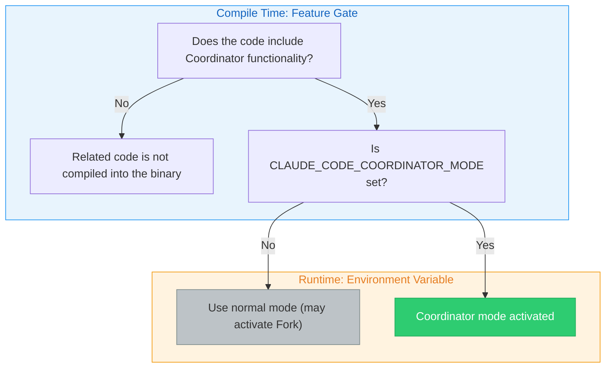

1. **Feature gate**: Determines at compile time whether to include the feature's code
2. **Environment variable**: `CLAUDE_CODE_COORDINATOR_MODE` controls activation at runtime

> **Design Insight: Why use dual gating instead of a single switch?**
>
> The feature gate is a compile-time optimization -- deployments that don't need Coordinator functionality (such as lightweight SDK embedding scenarios) can completely exclude the related code, reducing binary size and attack surface. The environment variable is a runtime control -- even in builds that include the feature, it must be explicitly enabled. This "compile-time exclusion + runtime explicit enable" pattern is common in enterprise software, satisfying both flexibility requirements and the principle of least privilege.

### Activation Conditions and Mutual Exclusion

The Coordinator pattern interacts with other patterns in multiple places. First is its mutual exclusion with the Fork pattern: when both satisfy their conditions simultaneously, the Coordinator pattern takes priority. This is because the Coordinator already has its own task delegation model and doesn't need the Fork pattern's implicit parallelism capabilities.

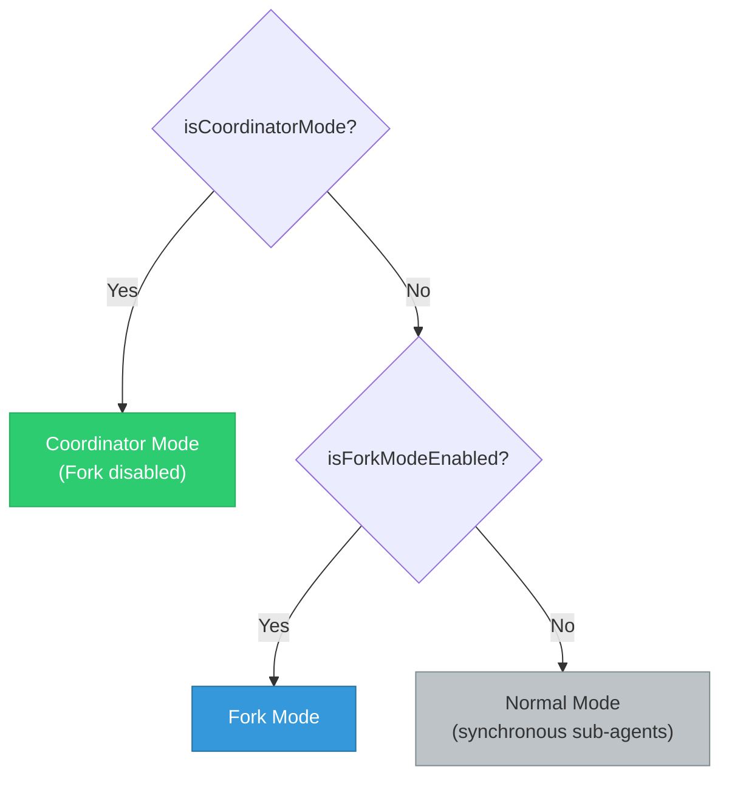

> **Cross-Reference:** The Fork pattern's cache sharing mechanism is discussed in detail in Chapter 9. The core difference between the two is: Fork is "centerless parallelism" (all sub-agents are equal and share the same context), while Coordinator is "centered orchestration" (the coordinator controls the global view, and workers only see the tasks assigned to them).

The Coordinator pattern also affects the agent registry. When Coordinator mode is activated, the built-in agent registration function no longer returns the normal list of built-in agents but instead introduces Coordinator-specific worker agent definitions through lazy loading. This lazy loading approach is intentional, aimed at avoiding circular dependencies between the coordinator module and the tool module.

### Pattern Matching for Session Recovery

The `matchSessionMode()` function handles pattern consistency during session recovery: when the current mode doesn't match the session's recorded mode, the system automatically flips the environment variable to match the session's mode. This ensures that when a user recovers a session created in Coordinator mode, the system automatically activates Coordinator mode, even if the current startup configuration doesn't have the environment variable set.

This design solves a practical problem: a user might set the Coordinator environment variable during one launch and create a session, but forget to set it when recovering that session later. Without automatic mode matching, the session would be restored in the wrong mode, leading to inconsistent behavior or even errors.

### The Coordinator's System Prompt

The Coordinator's role is defined in the system prompt generation function -- a carefully crafted system prompt that specifies the complete behavioral norms for the coordinator. Key points include:

**Role Definition**: The coordinator is not an executor but an orchestrator. It directly answers simple questions and delegates complex tasks to workers.

**Tool Set**: The coordinator has only four core tools -- the Agent tool for spawning workers, the TaskStop tool for stopping workers, the SendMessage tool for sending messages to workers, and the structured output tool.

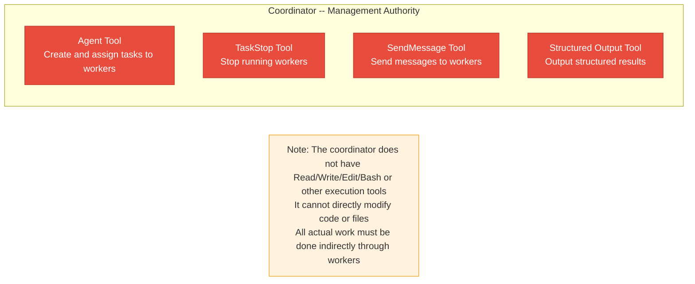

**Key Constraints**: The system prompt explicitly prohibits the coordinator from "using one worker to inspect another worker," "using a worker to simply report file contents," or "predicting or fabricating agent results." These constraints ensure that the coordinator manages all communication directly, preventing overly long information-passing chains.

> **Anti-Pattern Warning: Why is "worker inspecting worker" prohibited?**
>
> Allowing Worker A to inspect Worker B's results creates an "information chain": Worker B completes its task -> Worker A reads B's results -> Worker A reports to the coordinator. This chain has two serious problems:
>
> 1. **Information decay**: Each transmission loses details. Like a game of telephone, information after multiple rounds of relay may differ greatly from the original result.
>
> 2. **Debugging difficulty**: When the final result is wrong, you need to trace back layer by layer to find which link caused the problem.
>
> The correct pattern is: the coordinator directly receives each worker's results, understands them itself, and then writes the next set of instructions.

---

## 10.2 Worker Tool Allocation

### INTERNAL_WORKER_TOOLS

Under the Coordinator pattern, workers' tool allocation is controlled through two sets. The internal worker tools set defines the tools that workers **should not see** -- these are the coordinator's exclusive tools, including team creation, team deletion, message sending, and structured output.

This forms a clear boundary of authority:

```mermaid
graph LR
    subgraph Coordinator["Coordinator -- Management Authority"]
        C1["Agent Tool"]
        C2["TaskStop Tool"]
        C3["SendMessage Tool"]
        C4["Structured Output"]
    end
    subgraph Worker["Worker -- Execution Authority"]
        W1["Read / Write"]
        W2["Edit / Bash"]
        W3["Grep / Glob"]
        W4["WebSearch"]
        W5["Skill / MCP"]
    end

    Coordinator x-- Management vs Execution --x Worker

    style C1 fill:#e74c3c,stroke:#c0392b,color:#fff
    style C2 fill:#e74c3c,stroke:#c0392b,color:#fff
    style C3 fill:#e74c3c,stroke:#c0392b,color:#fff
    style C4 fill:#e74c3c,stroke:#c0392b,color:#fff
    style W1 fill:#3498db,stroke:#2471a3,color:#fff
    style W2 fill:#3498db,stroke:#2471a3,color:#fff
    style W3 fill:#3498db,stroke:#2471a3,color:#fff
    style W4 fill:#3498db,stroke:#2471a3,color:#fff
    style W5 fill:#3498db,stroke:#2471a3,color:#fff
```

### Simple Mode and Full Mode Tool Sets

The `getCoordinatorUserContext()` function returns different tool descriptions based on the mode:

- **Simple Mode**: Workers only have Bash, Read, and Edit tools, suitable for resource-constrained environments
- **Full Mode**: Workers have all whitelisted tools except internal tools, including Read, Write, Edit, Bash, Grep, Glob, WebSearch, WebFetch, NotebookEdit, Skill, ToolSearch, and more

| Mode | Tool Set | Applicable Scenarios |
|------|----------|---------------------|
| Simple | Bash, Read, Edit | CI/CD environments, resource-constrained containers, quick validation |
| Full | All whitelisted tools | Local development, full IDE integration, complex refactoring |

In Full mode, workers can also use MCP tools and Skill tools. The system prompt informs the coordinator of the available worker tool list through user context.

> **Practical Scenario: When to Use Simple Mode?**
>
> Simple mode is suitable for the following scenarios:
> - **Automated tasks in CI/CD pipelines**: Build servers don't need web search or file discovery
> - **Quick fix tasks**: Simple fixes that only require reading, editing, and running tests
> - **Security-restricted environments**: Minimizing the tool set reduces potential security risks
> - **Resource-constrained containers**: Reduces tool initialization overhead

### Independent Assembly of the Tool Pool

Workers' tool pools are assembled independently from the parent level, ensuring that workers always get the complete tool set, unaffected by parent-level tool restrictions. Workers default to the `acceptEdits` permission mode (automatically accept file edits), unless the agent definition specifies another mode.

This design decision reflects an important principle: **workers are executors and should not be hindered by permission issues**. If a worker needed user confirmation every time it edited a file, the advantages of multi-agent collaboration would be completely negated. Of course, this requires the coordinator to assign tasks correctly -- if given the wrong modification task, a worker will execute it without hesitation.

> **Best Practice: Pre-confirm Task Scope Under Coordinator Mode**
>
> Since workers automatically accept edits, users should review the overall plan before the Coordinator accepts a task. It's recommended to add a prompt in CLAUDE.md requiring the coordinator to present the complete task allocation plan before starting the Implementation phase.

---

## 10.3 Team Management

### TeamCreateTool / TeamDeleteTool

The Coordinator pattern shares team infrastructure with Agent Teams (multi-agent swarms). The team creation tool is responsible for creating teams, and its core process includes: checking whether already in a team (a leader can only manage one team), generating a unique team name, creating a team file (containing team name, leader ID, session ID, member list, etc.), then writing the team file, updating global state, and setting up the task list.

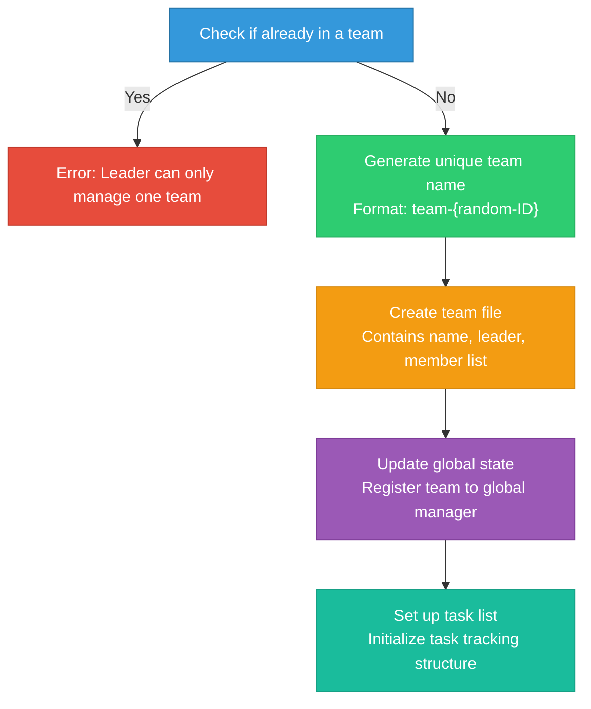

The team deletion tool handles cleanup: it first checks whether there are still active members, only allowing cleanup after all members have completed their work, then clears the team directory, worktree, and team context.

### Safety Guarantees for Team Deletion

Team deletion is not a simple "delete everything" operation but a process with multiple safety checks:

1. **Active member check**: If workers are still running, deletion is refused and the list of still-running members is returned
2. **Resource cleanup order**: Clean team directory (Scratchpad, etc.) first, then worktree, then team context
3. **Error tolerance**: Failure to clean up a single resource does not prevent cleanup of other resources

> **Anti-Pattern Warning: Do Not Delete a Team Before Work Is Complete**
>
> If the coordinator forcefully deletes a team while workers are still running, the workers will lose their association with the team, which may lead to:
> - Worker task notifications failing to reach the coordinator
> - Scratchpad files being deleted while in-use workers read empty data
> - Worktrees being cleaned up, causing workers' file modifications to be lost
>
> This is why team deletion requires the precondition that "all members have completed."

### SendMessageTool Message Passing

The message sending tool is the core communication channel for team collaboration. It supports four message types: close requests, close responses, and plan approval responses.

Addressing modes for message passing:

| Addressing Mode | Format | Use Case | Communication Scope |
|----------------|--------|----------|-------------------|
| Point-to-point | `to: "agent-name"` | Send specific instructions to a designated worker | Single worker |
| Broadcast | `to: "*"` | Publish public information to all workers | All workers |
| UDS | `to: "uds:<socket-path>"` | Cross-process communication (different CLI instances) | Cross-process |
| Bridge | `to: "bridge:<session-id>"` | Cross-session/cross-machine communication | Cross-session/remote |

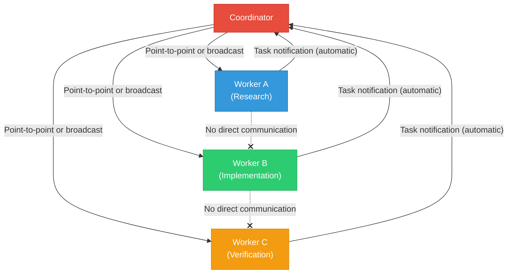

The message sending tool's intelligent routing mechanism is particularly noteworthy: when the coordinator sends a message to a running worker, the system queues the message for the next round of tool invocation; when sending to a stopped worker, the system automatically resumes that worker and delivers the message as a new prompt. This "stop-resume" pattern allows the coordinator to efficiently manage workers' lifecycles.

> **Design Insight: The Economy of the Stop-Resume Pattern**
>
> Workers are not "always online." A research worker stops after completing its investigation, releasing API connections and memory resources. But the coordinator may later need to give this worker an additional task (e.g., "For module X you investigated earlier, look deeper into the dependency relationships"). The stop-resume pattern allows workers to be reactivated when needed without rebuilding context from scratch. This both saves resources and preserves the previous analysis state.

---

## 10.4 Collaboration Space

### Scratchpad Collaboration Space Design

The Coordinator pattern introduces the Scratchpad concept -- a shared temporary file space across workers. In the system prompt, when the Scratchpad feature is enabled, descriptive information is appended to the coordinator, informing it that workers can freely read and write to this directory without permission prompts, and suggesting its use for durable cross-worker knowledge storage.

The Scratchpad's physical location is in a session-specific subdirectory under the project's temporary directory, with the path format `/tmp/claude-{uid}/{sanitized-cwd}/{sessionId}/scratchpad/`. Each session has an independent scratchpad directory.

The Scratchpad's design principles are:

1. **No permission prompts**: Workers can freely read and write to the scratchpad directory without user confirmation
2. **Persistent cross-worker knowledge**: One worker can write findings to the scratchpad, and another worker can read them
3. **Session isolation**: Each session's scratchpad is independent, avoiding cross-session contamination
4. **Structural freedom**: The system does not prescribe a file structure; workers organize it as needed

In the Coordinator's system prompt, the scratchpad is described as "durable cross-worker knowledge," hinting at its core purpose: serving as shared memory between workers.

#### Typical Scratchpad Usage Patterns

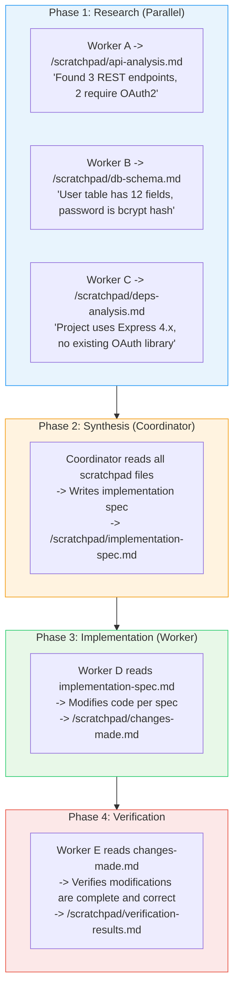

> **Why not let workers pass messages to each other directly?**
>
> Message passing is ephemeral -- once consumed, it's gone. The Scratchpad, on the other hand, is persistent and can be read repeatedly by any number of workers. During the research phase, Worker A's findings are needed not only by the coordinator but also potentially by subsequent verification workers. With message passing, the coordinator would need to forward the findings to every worker that needs them; with Scratchpad, workers can read on demand.
>
> Additionally, the Scratchpad naturally supports "incremental building" -- Worker A writes a foundational analysis, and Worker B can append supplementary information on top of it, without needing to consolidate everything into a single message.

### The Coordinator's Task Workflow

The Coordinator system prompt defines four phases of the standard task workflow:

| Phase | Executor | Purpose | Typical Output |
|-------|----------|---------|---------------|
| Research | Workers (parallel) | Investigate the codebase, discover files, understand the problem | Scratchpad analysis documents |
| Synthesis | Coordinator | Read findings, understand the problem, write implementation spec | Implementation specification document |
| Implementation | Workers | Make precise modifications according to the spec | Code changes |
| Verification | Workers | Test whether modifications are correct | Test results and issue list |

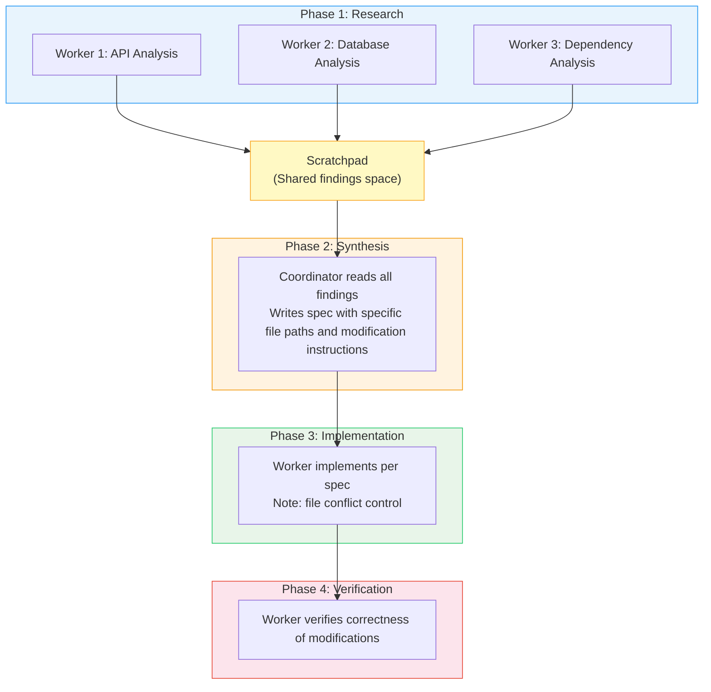

The key constraint of this workflow is that **the coordinator must understand the research findings before it can write the implementation spec**. The system prompt uses strong language to emphasize:

> "Never write 'based on your findings' or 'based on the research.' These phrases delegate understanding to the worker instead of doing it yourself. You never hand off understanding to another worker."

This means the coordinator cannot simply forward a worker's findings to another worker -- it must first digest those findings, then write an implementation spec that includes specific file paths, line numbers, and modification instructions.

> **Design Philosophy: Why Can't "Understanding" Be Delegated?**
>
> This is one of the most core design principles of the Coordinator pattern. In traditional master-slave architectures, the master node can simply forward a slave node's results to another slave node. But in an AI agent system, this forwarding leads to severe context loss issues:
>
> - **Format inconsistency**: Different workers produce output in different formats; direct forwarding causes the recipient to be unable to understand
> - **Coexistence of information redundancy and gaps**: Worker A's report may contain大量 irrelevant details while missing critical information
> - **Lack of global perspective**: Each worker only sees the portion it investigated and cannot make globally optimal decisions
>
> Requiring the coordinator to "digest" all findings before writing the spec ensures that workers in the implementation phase receive unified, precise, and contextualized instructions.

### Concurrency Strategy

The Coordinator system prompt defines a clear concurrency strategy:

| Task Type | Concurrency Strategy | Reason |
|-----------|---------------------|--------|
| Read-only tasks (Research) | Free parallelism | No conflicts will arise |
| Write-heavy tasks (Implementation) | One at a time per file set | Prevent file write conflicts |
| Verification | Sometimes parallel with implementation | Safe when operating on different file regions |

```mermaid
---
config:
  gantt:
    leftPadding: 180
---
gantt
    title Concurrency Strategy Example (OAuth2 Integration Task)
    dateFormat X
    axisFormat %s

    section Research (All Parallel)
    Worker A: API Analysis     :a1, 0, 4
    Worker B: Database Analysis :a2, 0, 4
    Worker C: Auth Analysis    :a3, 0, 4

    section Implementation (Exclusive Files)
    Worker D: route/auth.ts :b1, 3, 6
    Worker E: db/migration.ts :b2, 6, 9

    section Verification (Parallel Verification)
    Worker F: Test auth     :c1, 9, 12
    Worker G: Test DB       :c2, 9, 12
```

The system prompt also encourages the coordinator to "fan out" -- initiating multiple parallel worker calls in a single message. This leverages Claude's parallel tool invocation capability, allowing multiple workers to start simultaneously.

### Task Notification Protocol

When workers complete, results are delivered to the coordinator in `<task-notification>` XML format:

```xml
<task-notification>
<task-id>{agentId}</task-id>
<status>completed|failed|killed</status>
<summary>{human-readable status summary}</summary>
<result>{agent's final text response}</result>
<usage>
  <total_tokens>N</total_tokens>
  <tool_uses>N</tool_uses>
  <duration_ms>N</duration_ms>
</usage>
</task-notification>
```

This format is designed to be embedded in user-role messages. The coordinator identifies `<task-notification>` tags to distinguish genuine user messages from workers' result reports. This design choice means the coordinator needs explicit instructions to differentiate message types, which is why the system prompt repeatedly emphasizes "Worker results are internal signals, not conversation partners."

> **Why XML format instead of JSON?**
>
> XML tags have better recognizability in LLM contexts than JSON. Claude models parse XML tags very reliably (related to extensive XML usage in training data), while JSON requires strict quote and comma matching. Additionally, explicit tag names like `<task-notification>` allow the model to quickly identify message types through simple pattern matching without full JSON parsing.

---

## 10.5 Complete Case Study: From Requirements to Delivery

Let's understand the Coordinator pattern's end-to-end workflow through a complete case study.

### Scenario: Adding a User Notification System to a Web Application

**Requirement Description:** "Add a notification system to our Express.js application that supports both email and in-app notification methods. Users should be able to manage notification preferences from the settings page."

#### Phase 1: Research

The coordinator dispatches three research workers simultaneously:

```
Coordinator Decision:
"This task involves three dimensions: backend API, database schema, and frontend UI.
 Launching three parallel researchers to investigate each."

  Worker "api-researcher":
    Task -> "Investigate the existing Express.js route structure, middleware chain, and API versioning strategy"
    Output -> /scratchpad/api-analysis.md
    Content -> "Found routes under src/routes/, using Express Router,
            middleware chain includes auth, rateLimit, validate.
            API versioning managed via URL prefix /api/v1/."

  Worker "db-researcher":
    Task -> "Investigate database schema, ORM models, and migration strategy"
    Output -> /scratchpad/db-analysis.md
    Content -> "Using Prisma ORM, schema in prisma/schema.prisma.
            Existing User model has id, email, name fields.
            Migrations managed via prisma migrate."

  Worker "frontend-researcher":
    Task -> "Investigate frontend framework, component structure, and state management approach"
    Output -> /scratchpad/frontend-analysis.md
    Content -> "Using React + TypeScript, components in src/components/.
            State management uses Zustand. Settings page in SettingsPage.tsx.
            UI component library uses shadcn/ui."
```

#### Phase 2: Synthesis

```
Coordinator Behavior:
  1. Read all three scratchpad files
  2. Understand the overall architecture and write implementation spec
  3. Write spec to /scratchpad/implementation-spec.md

  Spec Contents:
  - Database: Add Notification and NotificationPreference models
  - API: Add 5 endpoints (GET/POST/PUT/DELETE notifications + PUT preference settings)
  - Service layer: Add NotificationService for email and in-app notifications
  - Frontend: Modify SettingsPage to add notification preference component
  - Dependencies: Need to add nodemailer package
```

#### Phase 3: Implementation

```
Coordinator Decision:
"Based on the spec, database migration and service layer implementation
 can safely execute in parallel since they operate on different files.
 Frontend implementation must wait until the backend is complete."

  Worker "db-implementer":
    Task -> Modify Prisma schema per scratchpad spec and create migration
    Files -> prisma/schema.prisma (exclusive)

  Worker "service-implementer":  <- Parallel with db-implementer
    Task -> Implement notification service layer and API routes
    Files -> src/services/notificationService.ts, src/routes/notifications.ts

  (Wait for both above to complete)

  Worker "frontend-implementer":
    Task -> Implement frontend notification preference component
    Files -> src/components/NotificationSettings.tsx, modify SettingsPage.tsx
```

#### Phase 4: Verification

```
  Worker "verifier":
    Task -> Verify the complete functionality of the notification system
    Checklist:
    - Is the Prisma migration correct?
    - Do the API endpoints conform to RESTful conventions?
    - Does the frontend component correctly call the API?
    - Are there any missing error handling?
    - Are the default notification preference values reasonable?
```

---

## 10.6 Fault Recovery and Partial Completion

### Handling Strategies for Worker Failures

In multi-agent collaboration, worker failures are the norm rather than the exception. The Coordinator needs to be capable of handling the following failure scenarios:

| Failure Type | Manifestation | Coordinator's Response Strategy |
|-------------|---------------|-------------------------------|
| Tool execution failure | A Bash command returns a non-zero exit code | Analyze failure cause, retry or adjust strategy |
| Model output truncation | maxTurns exhausted, task incomplete | Evaluate completed portion, decide whether to reassign |
| MCP connection dropped | External tool unavailable | Degrade to a strategy that doesn't depend on that tool |
| Context too long | Conversation history exceeds token limit | Compress context or split task into smaller sub-tasks |

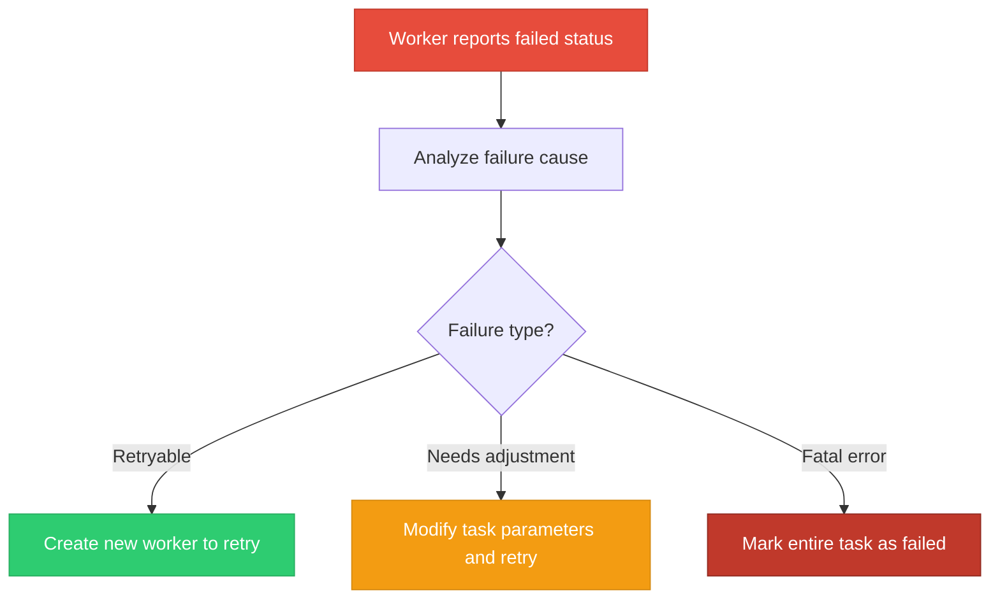

### Handling Partial Completion

When a research-phase worker only completes a partial investigation (e.g., analyzed the API layer but not the database layer), the coordinator faces a choice: proceed with available information, or wait for a complete analysis.

The guiding principle in the system prompt is: **the coordinator should make full use of completed work rather than waiting for perfect information**. If Worker A completed 80% of the code investigation, the coordinator should write the implementation spec based on that 80% of information, flagging uncertain portions in the spec so the implementation worker can conduct supplementary investigation when encountering uncovered areas.

> **Best Practice: Use "Confidence Annotations" in the Scratchpad**
>
> It's recommended that the coordinator use confidence annotations in the implementation spec, for example:
> - [HIGH] Confirmed file paths and function signatures are correct
> - [MEDIUM] Inferred dependency relationships that need verification during implementation
> - [LOW] Areas not fully investigated; additional research needed before implementation
>
> These annotations let implementation workers know which parts can be executed directly and which need confirmation first.

---

## 10.7 Coordinator Pattern vs. Fork Pattern Comparison

The two patterns represent different parallelism strategies, and choosing the correct one is critical for task success.

| Dimension | Coordinator Pattern | Fork Pattern |
|-----------|-------------------|-------------|
| **Architecture Model** | Centralized (coordinator-worker) | Decentralized (peer parallelism) |
| **Context Sharing** | Workers only see assigned tasks | All sub-agents inherit the full parent context |
| **Communication Method** | Coordinator relays, Scratchpad sharing | No direct communication, each operates independently |
| **Task Allocation** | Explicit allocation, precise control | Implicit parallelism, each executes independent sub-tasks |
| **Result Aggregation** | Coordinator synthesizes all results | Primary agent collects as needed |
| **Cache Efficiency** | No shared cache prefix | Byte-level sharing, efficient caching |
| **Applicable Scenarios** | Coordinated, complex multi-step tasks | Independent parallel investigation/search tasks |
| **Fault Recovery** | Coordinator can reassign tasks | Primary agent decides after receiving failure notification |
| **Resource Overhead** | Higher (coordinator is persistent) | Lower (shared cache) |
| **Mental Model** | Construction site (project manager + workers) | Scout team (multiple independent scouts) |

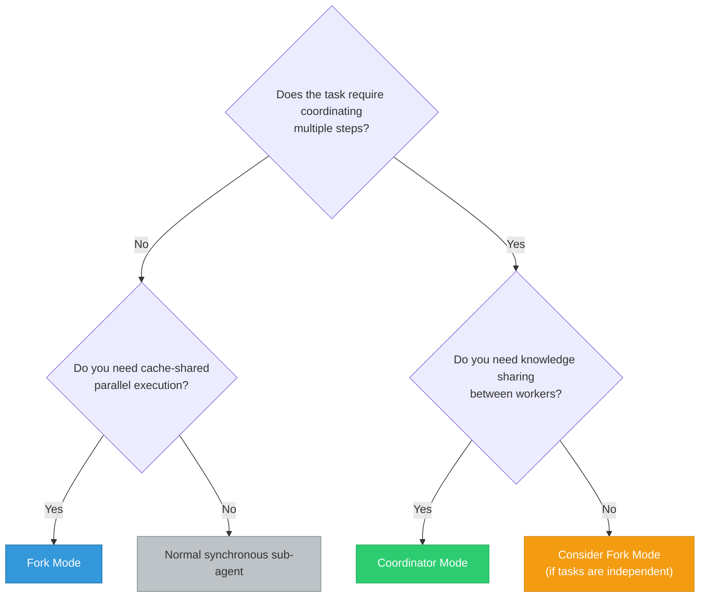

> **Cross-Reference:** The detailed mechanism of the Fork pattern is covered in Chapter 9. Pay special attention to the mutual exclusion between the two -- when Coordinator mode is activated, Fork mode is automatically disabled.

---

## Hands-On Exercises

**Exercise 1: Design a Multi-Worker Workflow**

Suppose you have a large-scale refactoring task: splitting a monolithic Express.js application into microservices. Design the workflow under the Coordinator pattern:

1. **Research Phase**: Plan how many Research workers you need and what module each should investigate
   - Hint: Consider five dimensions -- routes, database, middleware, configuration, and tests
2. **Synthesis Phase**: How should the coordinator synthesize findings and write the microservice splitting specification
   - Hint: Consider service boundaries, shared databases, API Gateway, etc.
3. **Implementation Phase**: How to allocate workers to avoid file conflicts
   - Hint: Allocate by service boundary; files for the same service should be handled by the same worker
4. **Verification Phase**: What is the verification strategy?
   - Hint: Each microservice is verified independently, followed by integration testing

**Exercise 2: Analyze Scratchpad Security Boundaries**

Consider the following questions about Scratchpad security design:
- What does the Scratchpad directory's permission setting (0o700) mean?
- Why isn't the Scratchpad placed inside the project directory?
- What happens if two workers write to the same Scratchpad file simultaneously?
- How should you design Scratchpad file naming conventions to avoid conflicts?

**Extended Thinking:** If you were to implement a "Scratchpad version control" feature (similar to Git), what metadata would need to be recorded? How would this change workers' write behavior?

**Exercise 3: Compare Coordinator Pattern vs. Fork Pattern**

Based on the content of this chapter and Chapter 9, fill in the table below and provide reasoning for each dimension's choice:

| Dimension | Coordinator Pattern | Fork Pattern |
|-----------|-------------------|-------------|
| Architecture Model | ? | ? |
| Context Sharing | ? | ? |
| Applicable Scenarios | ? | ? |
| Communication Method | ? | ? |
| Cache Efficiency | ? | ? |
| Fault Recovery | ? | ? |
| Resource Overhead | ? | ? |

**Exercise 4: Design a Fault Recovery Strategy**

Suppose in a Coordinator workflow, a worker in the Implementation phase fails while modifying the database schema (migration script execution error). Design:
1. How the Coordinator detects this failure
2. How the Coordinator decides whether to retry or adjust the strategy
3. How already partially completed modifications are handled
4. How other workers executing in parallel are affected

**Exercise 5: Simulate a Complete Coordinator Workflow**

Choose a project you're familiar with and design a Coordinator workflow for the following task:

Task: "Add internationalization (i18n) support to the project, supporting both Chinese and English languages."

Requirements:
- List the investigation directions needed for the Research phase
- Write an outline of the implementation spec for the Synthesis phase
- Design the worker allocation for the Implementation phase
- Plan the verification checklist for the Verification phase

---

## Key Takeaways

1. **The Coordinator pattern employs a "coordinator-worker" architecture**, where the coordinator only manages task allocation and result synthesis without directly performing implementation work. This layered design enables complex engineering tasks to be systematically decomposed and processed in parallel.

2. **The dual gating mechanism** (feature gate + environment variable) and mutual exclusion with the Fork pattern ensure clarity in mode selection. `matchSessionMode()` guarantees pattern consistency during session recovery.

3. **Tool isolation strategy**: The coordinator has only four core orchestration tools, while workers have the full development toolset but exclude team management tools. Independent assembly of the tool pool ensures workers are not affected by parent-level restrictions. Simple mode and Full mode adapt to different resource environments.

4. **SendMessage's intelligent routing** supports point-to-point, broadcast, cross-process, and cross-session communication, and implements the ability to automatically resume stopped workers, enabling "stop-continue" workflows.

5. **The Scratchpad collaboration space** provides a permission-prompt-free shared directory across workers, with each session being independent and structurally free. It serves as the bridge for persistent knowledge transfer between workers, compensating for the limitation that workers cannot communicate directly with each other.

6. **The four-phase workflow** (Research -> Synthesis -> Implementation -> Verification) provides a structured task execution pattern. The core constraint is that the coordinator must digest research findings before writing the implementation spec; delegating understanding is not allowed.

7. **Fault recovery** is a built-in capability of the Coordinator pattern. Through the status field in task notifications, partial results in the Scratchpad, and the coordinator's reassignment capability, the system can gracefully handle worker failures and partial completion.

8. **Pattern selection**: Coordinator is suitable for coordinated, complex multi-step tasks, while Fork is suitable for independent parallel search tasks. The two are mutually exclusive and cannot be used simultaneously. Understanding the strengths and limitations of each is key to making the right choice.
